# 🗃️ Prática 1 - Problema 11

<div align="center">
   
   
   
   
</div>

## 📌 Tópicos 
<details>
  <summary>Sumário</summary>
    <ol>
        <li><a href="#-introdução">Introdução</a>
            <ol>
                <li><a href="#-descrição-do-problema">Descrição do Problema</a></li>
                <li><a href="#-abordagens">Abordagens</a></li>
                <li><a href="#-objetivo">Objetivo</a></li>
            </ol>
        </li>
        <li><a href="#%EF%B8%8F-desenvolvimento">Desenvolvimento</a>
            <ol>
                <li><a href="#1%EF%B8%8F⃣-proposta-1">Proposta 1</a></li>
                <li><a href="#2%EF%B8%8F⃣-proposta-2">Proposta 2</a></li>
                <li><a href="#3%EF%B8%8F⃣-proposta-3">Proposta 3</a></li>
                <li><a href="#4%EF%B8%8F⃣-proposta-4">Proposta 4</a></li>
                <li><a href="#5%EF%B8%8F⃣-proposta-5">Proposta 5</a></li>
                <li><a href="#6%EF%B8%8F⃣-proposta-6">Proposta 6</a></li>
            </ol>
        </li>
        <li><a href="#-implementação">Implementação</a>
            <ol>
                <li><a href="#-arquivo-problema11hpp">Arquivo problema11.hpp</a>
                    <ul>
                        <li><a href="#-includes">Includes</a></li>
                        <li><a href="#-declaração-das-funções">Declaração das funções</a></li>
                    </ul>
                </li>
                <li><a href="#-arquivo-problema11cpp">Arquivo problema11.cpp</a>
                    <ul>
                        <li><a href="#-funções-de-geração-de-processos-e-arquivos">Funções de Geração de Processos e Arquivos</a></li>
                        <li><a href="#%EF%B8%8F-outras-funções">Outras Funções</a></li>
                        <li><a href="#-funções-de-proposta">Funções de Proposta</a></li>
                        <li><a href="#-funções-de-ordenação">Funções de Ordenação</a></li>
                        <li><a href="#-funções-de-cache">Funções de Cache</a></li>
                        <li><a href="#%EF%B8%8F-funções-de-limpeza">Funções de Limpeza</a></li>
                    </ul>
                </li>
                <li><a href="#-arquivo-maincpp">Arquivo main.cpp</a></li>
                <li><a href="#-arquivo-gerargraficopy">Arquivo gerarGrafico.py</a></li>
            </ol>
        </li>
        <li><a href="#-análise-de-complexidade-de-cada-proposta">Análise de Complexidade de Cada Proposta</a>
            <ol>
                <li><a href="#-análise-de-complexidade-da-proposta-1">Análise de Complexidade da Proposta 1</a>
                    <ul>
                        <li><a href="#-cálculo-da-complexidade-total">Cálculo da Complexidade Total</a></li>
                    </ul>
                </li>
                <li><a href="#-análise-de-complexidade-da-proposta-2">Análise de Complexidade da Proposta 2</a>
                    <ul>
                        <li><a href="#-cálculo-da-complexidade-total">Cálculo da Complexidade Total</a></li>
                    </ul>
                </li>
                <li><a href="#-análise-de-complexidade-da-proposta-3">Análise de Complexidade da Proposta 3</a>
                    <ul>
                        <li><a href="#-cálculo-da-complexidade-total">Cálculo da Complexidade Total</a></li>
                    </ul>
                </li>
                <li><a href="#-análise-de-complexidade-da-proposta-4">Análise de Complexidade da Proposta 4</a>
                    <ul>
                        <li><a href="#-cálculo-da-complexidade-total">Cálculo da Complexidade Total</a></li>
                    </ul>
                </li>
                <li><a href="#-análise-de-complexidade-da-proposta-5">Análise de Complexidade da Proposta 5</a>
                    <ul>
                        <li><a href="#-cálculo-da-complexidade-total">Cálculo da Complexidade Total</a></li>
                    </ul>
                </li>
                <li><a href="#-análise-de-complexidade-da-proposta-6">Análise de Complexidade da Proposta 6</a>
                    <ul>
                        <li><a href="#-cálculo-da-complexidade-total">Cálculo da Complexidade Total</a></li>
                    </ul>
                </li>
                <li><a href="#-comparação-entre-as-propostas">Comparação entre as Propostas</a>
                    <ol>
                        <li><a href="#1%EF%B8%8F⃣-proposta-1">Proposta 1</a></li>
                        <li><a href="#2%EF%B8%8F⃣-proposta-2">Proposta 2</a></li>
                        <li><a href="#3%EF%B8%8F⃣-proposta-3">Proposta 3</a></li>
                        <li><a href="#4%EF%B8%8F⃣-proposta-4">Proposta 4</a></li>
                        <li><a href="#5%EF%B8%8F⃣-proposta-5">Proposta 5</a></li>
                        <li><a href="#6%EF%B8%8F⃣-proposta-6">Proposta 6</a></li>
                    </ol>
                </li>
            </ol>
        </li>
        <li><a href="#-estrutura-de-diretórios">Estrutura de Diretórios</a></li>
        <li><a href="#-como-usar">Como Usar</a></li>
        <li><a href="#-exemplos">Exemplos</a>
            <ul>
                <li><a href="#-apresentação-do-problema">Apresentação do problema</a></li>
                <li><a href="#-gerando-arquivos-e-processos">Gerando Arquivos e Processos</a></li>
                <li><a href="#%EF%B8%8F-medição-do-tempo-de-execução-das-propostas">Medição do Tempo de Execução das Propostas</a></li>
                <li><a href="#-arquivo-outputtxt">Arquivo output.txt</a></li>
                <li><a href="#-arquivo-tempos_execuçãocsv">Arquivo tempos_execução.csv</a></li>
                <li><a href="#-gerando-gráfico">Gerando Gráfico</a></li>
                <li><a href="#-análise-de-resultados">Análise de Resultados</a></li>
                <li><a href="#-agradecimento-e-dados">Agradecimento e dados</a></li>
            </ul>
        </li>
        <li><a href="#-análises-testes-e-estudos">Análises, Testes e Estudos</a>
            <ul>
                <li><a href="#--mesmo-valores-para-quantidade-de-processos-arquivos-linhas-e-arquivos-por-linha">Mesmo valores para quantidade de processos, arquivos, linhas e arquivos por linha</a></li>
                <li><a href="#--valores-maiores-de-processos-do-que-arquivos-linhas-e-arquivos-por-linha">Valores maiores de processos do que arquivos, linhas e arquivos por linha</a></li>
                <li><a href="#--valores-maiores-de-arquivos-do-que-processos-linhas-e-arquivos-por-linha">Valores maiores de arquivos do que processos, linhas e arquivos por linha</a></li>
                <li><a href="#--valores-maiores-de-linhas-do-que-processos-arquivos-e-arquivos-por-linha">Valores maiores de linhas do que processos, arquivos e arquivos por linha</a></li>
                <li><a href="#--valores-maiores-de-arquivos-por-linha-do-que-processos-arquivos-e-linhas">Valores maiores de arquivos por linha do que processos, arquivos e linhas</a></li>
            </ul>
        </li>
        <li><a href="#-escolha-da-melhor-proposta">Escolha da Melhor Proposta</a>
            <ul>
                <li><a href="#-justificativa-para-parar-de-procurar-outras-maneiras"> Justificativa para Parar de Procurar Outras Maneiras</a></li>
            </ul>
        </li>
        <li><a href="#-conclusão">Conclusão</a></li>
        <li><a href="#-ambiente-de-compilação">Ambiente de Compilação</a></li>
        <li><a href="#-makefile">MakeFile</a></li>
        <li><a href="#-contato">Contato</a></li>
        <li><a href="#-referências">Referências</a></li>
    </ol>
</details>

## 🚀 Introdução 
Este problema foi apresentado através de uma atividade, Prática 1, do professor Michel Pires na disciplina de Algoritmos e Estruturas de Dados I. A atividades Prática 1 é composta por problemas sobre Análise Assintótica e Complexidade Computacional. O chamado Problema 11, consiste inicialmente em fazer o cálculo das somas das raízes quadradas dos números contidos em arquivos referenciados por arquivos de processo. A ideia do professor é fazer com que seus alunos sejam incentivados a explorar as oportunidades de avaliação e melhoria, discutindo essas melhorias e seus possíveis custos operacionais. 
<p align="right"><a href="#-tópicos">⬆️ Voltar para o Sumário</a></p>

### 🔍 Descrição do Problema
Temos dois tipos principais de arquivos:
1. **Arquivos de Processos (`P1.txt`, `P2.txt`, ..., `PQ.txt`):** Cada um desses arquivos contém linhas que listam IDs de outros arquivos de dados. Cada linha representa um conjunto de arquivos a serem processados juntos *(< L1, 04, 07, 01, 01, 07, 06, . . . , 03 >)*. 
2. **Arquivos Referenciados (`A1.txt`, `A2.txt`, ..., `AN.txt`):** Estes arquivos contêm contém 100.000 números de ponto flutuante aleatórios, variando de 1 a 1.000.000 dos quais precisamos calcular a soma das raízes quadradas.

Para cada linha em cada arquivo de processo, precisamos:
1. Ler os IDs dos arquivos referenciados.
2. Para cada arquivo referenciado, calcular a soma das raízes quadradas dos números contidos nele.
3. Acumular esses resultados e escrever a soma no arquivo de saída correspondente.
<p align="right"><a href="#-tópicos">⬆️ Voltar para o Sumário</a></p>

### 💡 Abordagens
Para resolver o problema de forma eficiente, foram implementadas seis propostas distintas:

- **Proposta 1:** Nessa proposta, o programa processa cada linha de um processo de forma sequencial, ou seja, ele processa a linha 1, depois a linha 2 e assim por diante até a última linha do processo.

- **Proposta 2:** Nessa proposta, o programa processa cada linha de um processo e reaproveita a operação de cálculo quando o número do arquivo for o mesmo, ou seja, se um arquivo já foi processado, a soma das raízes quadradas é guardada e utilizada apenas esse resultado, sem a necessidade de calcular tudo de novo, isso para cada processo.

- **Proposta 3:** Nessa proposta, semelhante à segunda, o que muda é que aqui é utilizado uma espécie de cache goblal para todos os processos. Na proposta 2, era calculada e armazenada a soma das raizes de cada arquivo por cada processo, ou seja quando mudava de processo aqueles resultados armazenados eram descartados. Aqui nesta proposta, as somas de cada arquivo é armazenada e mantida mesmo na troca de um processo para outro.

- **Proposta 4:** Nessa proposta, utilizando a ideia da proposta 3, e buscando com que o tempo de execução seja ainda menor, foi implementado um algoritmo de ordenação quicksort para ordenar cada processo de acordo com a quantidade de arquivos por linha, fazendo com que a linha com mais arquivos seja processada primeiro, para que o reaproveitamento de cálculos seja mais eficiente.

- **Proposta 5:** Nessa proposta, semelhante à proposta 3, foi implementado um cache de arquivos, onde o programa armazena os resultados de cada arquivo em um vetor de cache, fazendo com que o reaproveitamento de cálculos seja mais eficiente. A diferença desta proposta para a proposta 3 é que aqui, o programa armazena os resultados de cada arquivo em um vetor de cache em ordem crescente, e quando um arquivo é processado, o programa busca no vetor de cache o resultado daquele arquivo usando busca binária. Se o arquivo não estiver no cache, o programa calcula a soma das raízes quadradas e armazena no cache.

- **Proposta 6:** Nessa proposta, semelhante à proposta 5, é calculada a soma das raízes quadradas de todos os arquivos antes de olhar para os processos e armazenada em um vetor de cache. Quando um arquivo é processado, o programa pega no vetor de cache o resultado daquele arquivo sem a necessidade de fazer uma busca. Se o arquivo não estiver no cache, o programa calcula a soma das raízes quadradas e armazena no cache.
<p align="right"><a href="#-tópicos">⬆️ Voltar para o Sumário</a></p>

### 🎯 Objetivo
O principal objetivo deste projeto é explorar as oportunidades de avaliação e melhoria, discutindo essas melhorias e seus possíveis custos operacionais, além de demonstrar como diferentes técnicas de otimização podem ser aplicadas para reduzir o tempo de processamento e aumentar a eficiência na leitura e cálculo de grandes volumes de dados. Através da comparação das seis abordagens, busca-se identificar a mais eficiente e escalável, oferecendo uma solução prática para problemas semelhantes em contextos de processamento intensivo de dados.
<p align="right"><a href="#-tópicos">⬆️ Voltar para o Sumário</a></p>


## 🛠️ Desenvolvimento
O desenvolvimento se iniciou na primeira proposta onde a ideia era apenas fazer o cálculo das somas das raízes sem pensar em nenhuma eficiência ou custeio. Esta proposta serviu como base para entender o problema e implementar a solução de forma direta.

### 1️⃣ Proposta 1
Na primeira abordagem, o programa processa cada linha de um processo de forma sequencial:
1. Ler os IDs dos arquivos referenciados.
2. Para cada arquivo, calcular a soma das raízes quadradas dos números contidos nele.
3. Acumular os resultados e escrever a soma no arquivo de saída correspondente.

Depois, uma proposta apresentada pelo próprio professor, de reaproveitar a operação de cálculo quando o número do arquivo for o mesmo. Assim foi feita na proposta 2.
<p align="right"><a href="#-tópicos">⬆️ Voltar para o Sumário</a></p>

### 2️⃣ Proposta 2
A segunda proposta introduziu um mecanismo para otimizar o tempo de processamento:
1. Implementar um armazenamento para os resultados das somas das raízes quadradas de cada arquivo processado.
2. Reutilizar os resultados armazenados para arquivos já processados, evitando cálculos redundantes, em cada processo.

Após ver a descrepante diferença entre o tempo de execução da proposta 1 e a proposta 2, pude pensar em uma maneira ainda melhor de otimizar esse tempo, pensando da mesma forma que na proposta 2. Na proposta anterior, a cada processo tinha um cache que armazenava as somas dos arquivos calculados, porém quando ia ter a troca de processo esse cache era apagado e um novo era criando, então foi implementado agora uma espécie de cache global, para que todos os processos que iam ser calculados pudessem ter acesso. 
<p align="right"><a href="#-tópicos">⬆️ Voltar para o Sumário</a></p>

### 3️⃣ Proposta 3
A terceira proposta aprimorou a reutilização dos cálculos:
1. Manter os resultados das somas das raízes quadradas dos arquivos processados, mesmo na troca de processos.
2. Melhorar a busca dos resultados armazenados no vetor, tornando o retorno dos valores mais eficiente.

Vendo agora uma maior eficiência e um melhor desempenho, pensei em ainda mais melhorar. A ideia era fazer com que fosse calculado uma grande quantidade de arquivos inicialmente para que já fosse armazenados para serem usados posteriormente. Então foi escolhido o método de ordenação QuickSort para ordenar as linhas dos processos. 
<p align="right"><a href="#-tópicos">⬆️ Voltar para o Sumário</a></p>

### 4️⃣ Proposta 4
A quarta proposta introduziu a ordenação das linhas dos processos para maximizar a eficiência:
1. Utilizar o algoritmo de ordenação quicksort para ordenar as linhas de cada processo pela quantidade de arquivos.
2. Processar primeiramente as linhas com mais arquivos, otimizando o reaproveitamento dos cálculos.

Após implementar essa ordenação e observar uma pequena melhoria no tempo de execução em alguns caso, a próxima etapa foi pensar em como armazenar esses resultados de forma mais eficiente, permitindo um acesso rápido e fácil durante o processamento. Então foi pensado apartir da proposta 3, uma maneira melhor de encontrar mais rápido oas dados no cache. Assim, a adição de novos itens no cache foi feita de forma crescente e para buscá-los foi implementado a busca binária. 
<p align="right"><a href="#-tópicos">⬆️ Voltar para o Sumário</a></p>

### 5️⃣ Proposta 5
A quinta proposta implementou uma ordenação no cache de arquivos para armazenamento e uma busca binária mais eficiente:
1. Armazenar os resultados das somas das raízes quadradas de cada arquivo em um vetor de cache em ordem crescente.
2. Utilizar busca binária para encontrar rapidamente os resultados no cache.
3. Caso o arquivo não esteja no cache, calcular a soma e armazenar o resultado.

Essa abordagem de cache mostrou-se altamente eficaz, reduzindo ainda mais o tempo de execução do programa. No entanto, ainda havia espaço para otimizações adicionais. Pensando na hipótese de não fazer uma busca, foi pensado em uma nova proposta que inicialmente calculava as somas das raízes quadradas de todos os arquivos antes de fazer os processamentos. 
<p align="right"><a href="#-tópicos">⬆️ Voltar para o Sumário</a></p>

### 6️⃣ Proposta 6
A sexta e última proposta combinou as melhorias anteriores com um cache global:
1. Calcular a soma das raízes quadradas de todos os arquivos e armazenar em um vetor de cache.
2. Aqui não há a necessidade de fazer algumas busca, ou calcular caso não tenha as somas no cache que todas já foram calculadas, e ele apenas pega o valor em um lugar da memória já pré-destinado.

Com essa última proposta, conseguimos alcançar um alto nível de eficiência e desempenho no processamento dos arquivos, atendendo aos requisitos do problema de forma otimizada e escalável.

O desenvolvimento dessas propostas permitiu explorar diversas técnicas de otimização, desde a abordagem sequencial simples até o uso de algoritmos avançados de busca e ordenação. Cada proposta foi projetada para melhorar o desempenho e a eficiência do processamento dos arquivos, fornecendo uma base sólida para a aplicação de técnicas de análise assintótica e complexidade computacional.
<p align="right"><a href="#-tópicos">⬆️ Voltar para o Sumário</a></p>


## 🧰 Implementação
Nesta seção, serão detalhadas as principais partes do código-fonte, incluindo a organização dos arquivos e as funções implementadas em cada um deles. Serão abordados os seguintes arquivos:

- `problema11.hpp`
- `problema11.cpp`
- `main.cpp`
- `gerarGrafico.py`
<p align="right"><a href="#-tópicos">⬆️ Voltar para o Sumário</a></p>

### 📁 Arquivo `problema11.hpp`
Arquivos com extensão `.hpp` são comumente usados em C++ para declarar classes, funções e variáveis que podem ser compartilhadas entre diferentes arquivos de código-fonte. No caso deste projeto, o arquivo `problema11.hpp` contém as declarações das funções principais utilizadas no programa.

#### 📎 Includes
Aqui, são incluídas diversas bibliotecas que fornecem funcionalidades essenciais para o programa:

- `iostream`: Essa biblioteca é utilizada para entrada e saída padrão, permitindo a interação do usuário com o programa por meio do terminal.

- `fstream`: Fornece classes e funções para trabalhar com arquivos, possibilitando a leitura e escrita de dados em arquivos do sistema.

- `ostream`: Fornece classes e funções relacionadas à saída de dados, permitindo a escrita de dados em fluxos de saída.

- `string`: Oferece suporte para manipulação de strings, permitindo a criação, manipulação e processamento de strings de caracteres.

- `vector`: Fornece uma implementação de vetor dinâmico em C++, permitindo a criação de arrays dinâmicos que podem crescer e diminuir de tamanho conforme necessário.

- `chrono`: Oferece suporte para medição de tempo de forma precisa, permitindo medir a duração de operações ou intervalos de tempo.

- `cmath`: Oferece funções matemáticas comuns, como operações aritméticas, funções trigonométricas e funções exponenciais.

- `random`: Fornece funções e classes para geração de números pseudoaleatórios, úteis em simulações e algoritmos que requerem aleatoriedade controlada.

- `cstdlib`: Fornece suporte para funções de propósito geral em C, incluindo alocação de memória dinâmica, conversão de tipos e manipulação de strings.

- `filesystem`: Introduzido no C++17, esta biblioteca oferece suporte para operações de sistema de arquivos, como manipulação de caminhos de arquivo e iteração de diretórios.
<p align="right"><a href="#-tópicos">⬆️ Voltar para o Sumário</a></p>

#### 📄 Declaração das funções
Aqui são declaradas as funções que serão utilizadas no programa. As funções são declaradas sem detalhes sobre suas implementações, pois serão discutidas em detalhes posteriormente em seus respectivos arquivos.
<p align="right"><a href="#-tópicos">⬆️ Voltar para o Sumário</a></p>

### 📁 Arquivo `problema11.cpp`

Este arquivo contém as implementações das funções declaradas em `problema11.hpp`.

#### 🔨 Funções de Geração de Processos e Arquivos

- `gerarProcessosEArquivos`: Esta função gera processos e arquivos com base nos parâmetros fornecidos.
- `gerarArquivos`: Gera arquivos com o nome especificado.
- `gerarProcessos`: Gera processos com o nome especificado e os vincula a arquivos existentes.

#### ✍🏼 Funções de Proposta

- `proposta1`, `proposta2`, `proposta3`, `proposta4`, `proposta5`, `proposta6`: Implementações das diferentes propostas de solução para o problema. Cada uma dessas funções lida com uma abordagem específica para processar conjuntos de dados.

#### ⚙️ Outras Funções

- `extrairArquivosPorLinha`: Extrai números de arquivo de uma linha de texto.
- `medindoTempoDeExecucaoDeCadaProposta`: Mede o tempo de execução de cada proposta.
- `limparArquivo`: Limpa o conteúdo de um arquivo.
- `calculandoASomaDasRaizQuadradaDeUmArquivo`: Calcula a soma das raízes quadradas dos números em um arquivo.
- `escreverResultadoNoArquivoDeSaida`: Escreve o resultado em um arquivo de saída.

#### 🔢 Funções de Ordenação

- `trocar`, `particao`, `quickSort`: Implementação do algoritmo QuickSort para ordenação de matrizes.

#### 💾 Funções de Cache

- `buscarNoCache`, `colocarCacheOrdenado`: Gerencia um cache de arquivos para otimização de acesso.

#### 🗑️ Funções de Limpeza

- `limparPastas`: Limpa pastas usadas durante a execução.
<p align="right"><a href="#-tópicos">⬆️ Voltar para o Sumário</a></p>


### 📁 Arquivo `main.cpp`

O arquivo `main.cpp` é o ponto de entrada principal do programa. Abaixo estão as principais funções e seu propósito:

- `void limparconsole()`: Esta função limpa a tela do console para uma melhor apresentação das informações.

- `void apresentacao()`: Esta função apresenta uma introdução ao usuário sobre o propósito do programa e as diferentes propostas de processamento de conjuntos de processos implementadas.

- `std::vector<int> preparandoConjuntos(int qntProcesso)`: Esta função solicita ao usuário a quantidade de conjuntos de processos que deseja medir o tempo de execução e retorna um vetor com a quantidade de processos em cada conjunto.

- `void gerenciandoMedicao(std::vector<int> qntConjuntosProcessos, int qntArquivos)`: Esta função coordena a medição do tempo de execução de cada proposta de solução para diferentes quantidades de conjuntos de processos e arquivos, escrevendo os resultados em um arquivo CSV.

- `void gerandoGrafico()`: Esta função gera um gráfico do desempenho das propostas de solução utilizando os dados contidos no arquivo CSV gerado durante a medição do tempo de execução.

- `void analiseDeResultados()`: Esta função realiza uma análise dos resultados obtidos após a medição do tempo de execução das propostas de solução, apresentando as principais conclusões.

- `void finalizando()`: Esta função é chamada no final da execução do programa e apresenta uma mensagem de encerramento.

- `int main()`: Esta é a função principal que inicia a execução do programa. Ela chama outras funções para realizar tarefas específicas, como apresentar uma introdução, gerar processos e arquivos, medir o tempo de execução das propostas de solução, gerar gráficos e realizar análises de resultados.
<p align="right"><a href="#-tópicos">⬆️ Voltar para o Sumário</a></p>

### 📁 Arquivo `gerarGrafico.py`

O arquivo `gerarGrafico.py` é um script Python responsável por gerar um gráfico do desempenho das diferentes propostas de solução implementadas no programa. O script tem como objetivo visualizar de forma gráfica o desempenho das diferentes propostas de solução em relação ao tempo de execução. O script lê os dados contidos no arquivo CSV gerado pelo programa principal, que contém informações sobre o tempo de execução de cada proposta para diferentes quantidades de conjuntos de processos. 

O script gerarGrafico.py utiliza as bibliotecas pandas e plotly.graph_objects para criar um gráfico de linhas que representa o desempenho das propostas implementadas. Abaixo está o código do script com explicações linha por linha:

- Essas linhas importam as bibliotecas necessárias para o script: 
    ```python
    import pandas as pd
    import plotly.graph_objects as go
    ```

- Aqui carrega os dados do arquivo CSV `tempos_execucao.csv` em um DataFrame do pandas.
    ```python
    df = pd.read_csv('./datasets/tempos_execucao.csv')
    ```
- Depois cria um novo objeto de figura para representar o gráfico.
    ```python
    fig = go.Figure()
    ```

- Este bloco de código itera sobre as colunas do DataFrame, adicionando uma linha ao gráfico para cada coluna.
    ```python
    for col in df.columns[1:]:
        fig.add_trace(go.Scatter(
            x=df['QuantidadeConjuntos'], 
            y=df[col], 
            mode='lines+markers', 
            name=col,
            marker=dict(size=10) 
        ))
    ```
- Nesta seção, são definidos o título do gráfico e os nomes dos eixos x e y. Além disso, são definidos o estilo do texto, as cores de fundo do papel e do gráfico, e o estilo da legenda.
    ```python
    fig.update_layout(
        title={
            'text': 'DESEMPENHO DAS PROPOSTAS',
            'x': 0.5,
            'xanchor': 'center',
            'yanchor': 'top',
            'font': {'family': 'Courier New', 'size': 40, 'color': 'white'}
        },
        xaxis_title='Quantidade de Conjuntos',
        yaxis_title='Tempo de Execução',
        font=dict(
            family="sans-serif",
            size=14,
            color="#7f7f7f"
        ),
        paper_bgcolor="black",
        plot_bgcolor="black",
        legend=dict(
            x=1,
            y=1,
            traceorder='normal',
            font=dict(
                family='sans-serif',
                size=12,
                color='white'
            ),
            bgcolor='black',
            bordercolor='black',
            borderwidth=1
        ),
        xaxis=dict(
            gridcolor='rgba(255, 255, 255, 0.2)' 
        ),
        yaxis=dict(
            gridcolor='rgba(255, 255, 255, 0.2)' 
        )
    )
    ```

- Este trecho adiciona uma anotação explicativa abaixo do título do gráfico.
    ```python
    fig.add_annotation(
        text="Quantidade de Conjuntos x Tempo de Execução",
        xref="paper", yref="paper",
        x=0.5, y=1.02,  
        showarrow=False,
        font=dict(
            family="Courier New",
            size=18,
            color="rgba(255, 255, 255)"  
        ),
        align="center"
    )
    ```

- Finalmente, esta última linha exibe o gráfico na tela, em uma janela do navegador.
    ```python
    fig.show()
    ```
<p align="right"><a href="#-tópicos">⬆️ Voltar para o Sumário</a></p>

## 📊 Análise de Complexidade de Cada Proposta
Para entendermos melhor cada o comportamento de cada uma das propostas, vamos analisar a complexidade para que possamos chegar em uma conclusão:

### 🧮 Análise de Complexidade da Proposta 1:

1. **Limpar Arquivo de Saída:**
    ```cpp
    limparArquivo("./datasets/output.txt");
    ```
    - Supondo que a função `limparArquivo` apenas abra o arquivo e o trunque, isso é uma operação constante, ou seja, *O(1)*.

2. **Loop Principal sobre Conjuntos de Processos:**
    ```cpp
    for (int i = 0; i < qntConjuntosProcessos; i++) {
    ```
    - Este loop itera *Q* vezes.

3. **Abrir Arquivo de Processo:**
    ```cpp
    std::string nomeProcesso = "./datasets/processos/P" + std::to_string(i + 1) + ".txt"; 
    std::ifstream processo(nomeProcesso);
    ```
    - Abrir um arquivo e verificar se ele está aberto são operações *O(1)*, mas são feitas *qntConjuntosProcessos* vezes.

4. **Loop sobre Linhas do Arquivo de Processo:**
    ```cpp
    while (std::getline(processo, linha)) {
    ```
    - Suponha que cada arquivo de processo tem em média *L* linhas.

5. **Extrair Arquivos por Linha:**
    ```cpp
    extrairArquivosPorLinha(linha, arquivosPorLinha);
    ```
    - Se cada linha do arquivo de processo contém em média *A* IDs de arquivos, essa operação é *O(A)*.

6. **Loop sobre IDs de Arquivos:**
    ```cpp
    for (int j = 0; j < arquivosPorLinha.size(); j++) {
        double somaPorCadaArquivo = calculandoASomaDasRaizQuadradaDeUmArquivo("./datasets/arquivos/" + std::to_string(arquivosPorLinha[j]) + ".txt");
        resultadoPorLinhaDeCadaProcesso += somaPorCadaArquivo;
    }
    ```
    - Cada chamada à função `calculandoASomaDasRaizQuadradaDeUmArquivo` envolve a leitura de um arquivo e o cálculo da soma das raízes quadradas de seus elementos. Se cada arquivo tiver em média *N* elementos, a complexidade dessa função é *O(N)*.
    - Portanto, o loop sobre os IDs de arquivos tem complexidade *O(A * N)* por linha.

7. **Escrever o Resultado no Arquivo de Saída:**
    ```cpp
    escreverResultadoNoArquivoDeSaida("./datasets/output.txt", resultadoDeCadaProcesso);
    ```
    - Escrever um resultado no arquivo de saída é uma operação *O(1)*, mas é feita *qntConjuntosProcessos* vezes.
<p align="right"><a href="#-tópicos">⬆️ Voltar para o Sumário</a></p>

#### 🔢 Cálculo da Complexidade Total:

Sabendo que:
- **Q**: Número de conjuntos de processos.
- **L**: Número médio de linhas por arquivo de processo.
- **A**: Número médio de IDs de arquivos por linha.
- **N**: Número médio de elementos por arquivo referenciado.

Para cada conjunto de processos:
- Abrir o arquivo de processo: *O(1)*
- Iterar sobre *L* linhas: *O(L)*
    - Extrair IDs de arquivos por linha: *O(A)*
    - Iterar sobre *A* IDs de arquivos: *O(A * N)*

Portanto, a complexidade para processar um conjunto de processos é:
**O(L * (A + A * N)) = O(L * A * (1 + N)) ≈ O(L * A * N)**.

Como isso é feito para *Q* conjuntos de processos, assim, a complexidade computacional de tempo da Proposta 1 é:
**O(Q * L * A * N)**.
<p align="right"><a href="#-tópicos">⬆️ Voltar para o Sumário</a></p>


### 🧮 Análise de Complexidade da Proposta 2:

1. **Limpar Arquivo de Saída:**
    ```cpp
    limparArquivo("./datasets/output.txt");
    ```
    - Complexidade: *O(1)*.

2. **Loop Externo:**
    ```cpp
    for (int i = 0; i < qntConjuntosProcessos; i++) {
    ```
    - Complexidade: *O(N)*, onde *N* é o número de conjuntos de processos.

3. **Abrir Arquivo de Processo:**
    ```cpp
    std::string nomeProcesso = "./datasets/processos/P" + std::to_string(i + 1) + ".txt"; 
    std::ifstream processo(nomeProcesso);
    ```
    - Complexidade: *O(1)*.

4. **Leitura e Processamento de Cada Linha do Arquivo de Processo:**
    ```cpp
    while (std::getline(processo, linha)) {
    ```
    - Complexidade: *O(L)*, onde *L* é o número de linhas no arquivo de processo.

5. **Extração de Arquivos por Linha:**
    ```cpp
    extrairArquivosPorLinha(linha, arquivosPorLinha);
    ```
    - Complexidade: *O(A)*, onde *A* é o número de caracteres na linha.

6. **Inicialização de Cache:**
    ```cpp
    std::vector<std::vector<double>> cacheArquivos;
    ```
    - Inicialização de um vetor, complexidade: *O(1)*.

7. **Loop Interno Sobre Arquivos Por Linha:**
    ```cpp
    for (int j = 0; j < arquivosPorLinha.size(); j++) {
    ```
    - Complexidade: *O(A)*, onde *A* é o número de arquivos referenciados em cada linha.

8. **Busca no Cache:**
    ```cpp
    for (std::vector<double> cache : cacheArquivos) {
        if (cache[0] == idArquivo) {
            somaPorCadaArquivo = cache[1];
            achou = true;
            break;
        }
    }
    ```
    - No pior caso, a busca no cache é linear em relação ao número de elementos no cache. Se denotamos o número de elementos no cache como *C*, a complexidade é *O(C)*.

9. **Cálculo da Soma das Raízes Quadradas (quando não está no cache):**
    ```cpp
    if (!achou) {
        somaPorCadaArquivo = calculandoASomaDasRaizQuadradaDeUmArquivo("./datasets/arquivos/" + std::to_string(idArquivo) + ".txt");
        cacheArquivos.push_back({static_cast<double>(idArquivo), somaPorCadaArquivo});
    }
    ```
    - Se não estiver no cache, a complexidade é *O(K)*, onde *K* é o número de números no arquivo.
    - Adicionar um novo elemento ao cache tem complexidade *O(1)*.

10. **Escrita no Arquivo de Saída:**
    ```cpp
    escreverResultadoNoArquivoDeSaida("./datasets/output.txt", resultadoDeCadaProcesso);
    ```
    - Complexidade: *O(1)*.
<p align="right"><a href="#-tópicos">⬆️ Voltar para o Sumário</a></p>

#### 🔢 Cálculo da Complexidade Total:

Vamos agora compilar as complexidades individuais para determinar a complexidade total da Proposta 2.

- O loop externo itera *N* vezes.
- Para cada iteração do loop externo, temos um loop que processa *L* linhas.
- Para cada linha, extraímos arquivos, o que tem uma complexidade *O(A)*, e iteramos sobre cada arquivo *A*.
- Para cada arquivo, primeiro realizamos uma busca no cache que tem complexidade *O(C)*. Se não for encontrado no cache, calculamos a soma das raízes quadradas dos números, o que tem uma complexidade *O(K)*.

A complexidade total pode ser expressa como:
**O(N * L * (M + A * (C + K)))**

Assumindo que *M* e *K* são relativamente pequenos comparados a *N*, *L*, e *A*, a complexidade pode ser aproximada por:
**O(N * L * A * (C + K))**
<p align="right"><a href="#-tópicos">⬆️ Voltar para o Sumário</a></p>

### 🧮 Análise de Complexidade da Proposta 3:

1. **Limpar Arquivo de Saída:**
    ```cpp
    limparArquivo("./datasets/output.txt");
    ```
    - Complexidade: *O(1)*.

2. **Inicialização do Cache:**
    ```cpp
    std::vector<std::vector<double>> cacheArquivos;
    ```
    - Complexidade: *O(1)*.

3. **Loop Externo:**
    ```cpp
    for (int i = 0; i < qntConjuntosProcessos; i++) {
    ```
    - Complexidade: *O(N)*, onde *N* é o número de conjuntos de processos.

4. **Abrir Arquivo de Processo:**
    ```cpp
    std::string nomeProcesso = "./datasets/processos/P" + std::to_string(i + 1) + ".txt"; 
    std::ifstream processo(nomeProcesso);
    ```
    - Complexidade: *O(1)*.

5. **Leitura e Processamento de Cada Linha do Arquivo de Processo:**
    ```cpp
    while (std::getline(processo, linha)) {
    ```
    - Complexidade: *O(L)*, onde *L* é o número de linhas no arquivo de processo.

6. **Extração de Arquivos por Linha:**
    ```cpp
    extrairArquivosPorLinha(linha, arquivosPorLinha);
    ```
    - Complexidade: *O(M)*, onde *M* é o número de caracteres na linha.

7. **Loop Interno Sobre Arquivos Por Linha:**
    ```cpp
    for (int j = 0; j < arquivosPorLinha.size(); j++) {
    ```
    - Complexidade: *O(A)*, onde *A* é o número de arquivos referenciados em cada linha.

8. **Busca no Cache:**
    ```cpp
    for (std::vector<double> cache : cacheArquivos) {
        if (cache[0] == idArquivo) {
            somaPorCadaArquivo = cache[1];
            achou = true;
            break;
        }
    }
    ```
    - No pior caso, a busca no cache é linear em relação ao número de elementos no cache. Se denotamos o número de elementos no cache como *C*, a complexidade é *O(C)*.

9. **Cálculo da Soma das Raízes Quadradas (quando não está no cache):**
    ```cpp
    if (!achou) {
        somaPorCadaArquivo = calculandoASomaDasRaizQuadradaDeUmArquivo("./datasets/arquivos/" + std::to_string(idArquivo) + ".txt");
        cacheArquivos.push_back({static_cast<double>(idArquivo), somaPorCadaArquivo});
    }
    ```
    - Se não estiver no cache, a complexidade é *O(K)*, onde *K* é o número de números no arquivo.
    - Adicionar um novo elemento ao cache tem complexidade *O(1)*.

10. **Escrita no Arquivo de Saída:**
    ```cpp
    escreverResultadoNoArquivoDeSaida("./datasets/output.txt", resultadoDeCadaProcesso);
    ```
    - Complexidade: *O(1)*.
<p align="right"><a href="#-tópicos">⬆️ Voltar para o Sumário</a></p>

#### 🔢 Cálculo da Complexidade Total:

Vamos agora compilar as complexidades individuais para determinar a complexidade total da Proposta 3.

- O loop externo itera *N* vezes.
- Para cada iteração do loop externo, temos um loop que processa *L* linhas.
- Para cada linha, extraímos arquivos, o que tem uma complexidade *O(M)*, e iteramos sobre cada arquivo *A*.
- Para cada arquivo, primeiro realizamos uma busca no cache que tem complexidade *O(C)*. Se não for encontrado no cache, calculamos a soma das raízes quadradas dos números, o que tem uma complexidade *O(K)*.

A complexidade total pode ser expressa como:
**O(N * L * (M + A * (C + K)))**

Assumindo que *M* e *K* são relativamente pequenos comparados a *N*, *L*, e *A*, a complexidade pode ser aproximada por:
**O(N * L * A * (C + K))**
<p align="right"><a href="#-tópicos">⬆️ Voltar para o Sumário</a></p>

### 🧮 Análise de Complexidade da Proposta 4:

1. **Limpar Arquivo de Saída:**
    ```cpp
    limparArquivo("./datasets/output.txt");
    ```
    - Complexidade: *O(1)*.

2. **Inicialização do Cache:**
    ```cpp
    std::vector<std::vector<double>> cacheArquivos;
    ```
    - Complexidade: *O(1)*.

3. **Loop Externo:**
    ```cpp
    for (int i = 0; i < qntConjuntosProcessos; i++) {
    ```
    - Complexidade: *O(N)*, onde *N* é o número de conjuntos de processos.

4. **Abrir Arquivo de Processo:**
    ```cpp
    std::string nomeProcesso = "./datasets/processos/P" + std::to_string(i + 1) + ".txt"; 
    std::ifstream processo(nomeProcesso);
    ```
    - Complexidade: *O(1)*.

5. **Leitura e Processamento de Cada Linha do Arquivo de Processo:**
    ```cpp
    while (std::getline(processo, linha)) {
    ```
    - Complexidade: *O(L)*, onde *L* é o número de linhas no arquivo de processo.

6. **Extração de Arquivos por Linha e Armazenamento:**
    ```cpp
    extrairArquivosPorLinha(linha, arquivosPorLinha);
    linhas.push_back(arquivosPorLinha);
    ```
    - Complexidade: *O(M)*, onde *M* é o número de caracteres na linha.

7. **Ordenação das Linhas:**
    ```cpp
    quickSort(linhas, 0, linhas.size() - 1);
    ```
    - A complexidade média do QuickSort é *O(L 
log L)*.

8. **Loop Interno Sobre Linhas e Arquivos Por Linha:**
    ```cpp
    for (int i = 0; i < linhas.size(); i++) {
    ```
    - Complexidade: *O(L)*.

    ```cpp
    for (int j = 0; j < linhas[i].size(); j++) {
    ```
    - Complexidade: *O(A)*.

9. **Busca no Cache:**
    ```cpp
    for (std::vector<double> cache : cacheArquivos) {
        if (cache[0] == idArquivo) {
            somaPorCadaArquivo = cache[1];
            achou = true;
            break;
        }
    }
    ```
    - No pior caso, a busca no cache é linear em relação ao número de elementos no cache. Se denotamos o número de elementos no cache como *C*, a complexidade é *O(C)*.

10. **Cálculo da Soma das Raízes Quadradas (quando não está no cache):**
    ```cpp
    if (!achou) {
        somaPorCadaArquivo = calculandoASomaDasRaizQuadradaDeUmArquivo("./datasets/arquivos/" + std::to_string(idArquivo) + ".txt");
        cacheArquivos.push_back({static_cast<double>(idArquivo), somaPorCadaArquivo});
    }
    ```
    - Se não estiver no cache, a complexidade é *O(K)*, onde *K* é o número de números no arquivo.
    - Adicionar um novo elemento ao cache tem complexidade *O(1)*.

11. **Escrita no Arquivo de Saída:**
    ```cpp
    escreverResultadoNoArquivoDeSaida("./datasets/output.txt", resultadoDeCadaProcesso);
    ```
    - Complexidade: *O(1)*.
<p align="right"><a href="#-tópicos">⬆️ Voltar para o Sumário</a></p>

#### 🔢 Cálculo da Complexidade Total:

Vamos agora compilar as complexidades individuais para determinar a complexidade total da Proposta 4.

- O loop externo itera *N* vezes.
- Para cada iteração do loop externo, temos um loop que processa *L* linhas.
- Extração de arquivos por linha tem uma complexidade *O(M)*, e armazenar essas linhas tem uma complexidade *O(1)*.
- Ordenação das linhas usando QuickSort tem complexidade *O(L log L)*.
- Para cada linha, iteramos sobre cada arquivo, o que tem uma complexidade *O(A)*.
- Para cada arquivo, realizamos uma busca no cache que tem complexidade *O(C)*. Se não for encontrado no cache, calculamos a soma das raízes quadradas dos números, o que tem uma complexidade *O(K)*.

A complexidade total pode ser expressa como:
**O(N * (L log L + L * (M + A * (C + K))))**

Assumindo que *M* e *K* são relativamente pequenos comparados a *N*, *L*, e *A*, a complexidade pode ser aproximada por:
**O(N * (L log L + L * A * (C + K)))**
<p align="right"><a href="#-tópicos">⬆️ Voltar para o Sumário</a></p>

### 🧮 Análise de Complexidade da Proposta 5:

1. **Limpar Arquivo de Saída:**
    ```cpp
    limparArquivo("./datasets/output.txt");
    ```
    - Complexidade: *O(1)*.

2. **Loop Externo:**
    ```cpp
    for (int i = 0; i < qntConjuntosProcessos; i++) {
    ```
    - Complexidade: *O(N)*, onde *N* é o número de conjuntos de processos.

3. **Abrir Arquivo de Processo:**
    ```cpp
    std::string nomeProcesso = "./datasets/processos/P" + std::to_string(i + 1) + ".txt"; 
    std::ifstream processo(nomeProcesso);
    ```
    - Complexidade: *O(1)*.

4. **Leitura e Processamento de Cada Linha do Arquivo de Processo:**
    ```cpp
    while (std::getline(processo, linha)) {
    ```
    - Complexidade: *O(L)*, onde *L* é o número de linhas no arquivo de processo.

5. **Extração de Arquivos por Linha:**
    ```cppN * L * A * K
    - Complexidade: *O(M)*, onde *M* é o número de caracteres na linha.

6. **Loop Interno Sobre Arquivos Por Linha:**
    ```cpp
    for (int j = 0; j < arquivosPorLinha.size(); j++) {
    ```
    - Complexidade: *O(A)*, onde *A* é o número de arquivos por linha.

7   . **Busca no Cache:**
    ```cpp
    double somaPorCadaArquivo = buscarNoCache(idArquivo, cacheArquivos);               
    ```
    - Complexidade: *O(logQ)* por ser uma busca binária em um cache de *Q* elementos.

8. **Cálculo da Soma das Raízes Quadradas (quando não está no cache):**
    ```cpp
    if (somaPorCadaArquivo == -1) { 
        somaPorCadaArquivo = calculandoASomaDasRaizQuadradaDeUmArquivo("./datasets/arquivos/" + std::to_string(idArquivo) + ".txt");
        colocarCacheOrdenado(cacheArquivos, idArquivo, somaPorCadaArquivo);
    }
    ```
    - Complexidade de calcular a soma: *O(K)*, onde *K* é o número de números no arquivo.
    - Complexidade de adicionar um novo elemento ao cache:*O(Q)* (no pior caso, por inserção ordenada).

9. **Escrita no Arquivo de Saída:**
    ```cpp
    escreverResultadoNoArquivoDeSaida("./datasets/output.txt", resultadoDeCadaProcesso);
    ```
    - Complexidade: *O(1)*.
<p align="right"><a href="#-tópicos">⬆️ Voltar para o Sumário</a></p>

#### 🔢 Cálculo da Complexidade Total:

Vamos agora compilar as complexidades individuais para determinar a complexidade total da Proposta 5.

- O loop externo itera *N* vezes.
- Para cada iteração do loop externo, temos um loop que processa *L* linhas.
- Extração de arquivos por linha tem uma complexidade *O(M)*.
- Para cada linha, iteramos sobre cada arquivo, o que tem uma complexidade *O(A)*.
- A busca no cache é *O(logQ)*,  Se o valor não estiver no cache, o cálculo tem complexidade *O(K)* e a inserção ordenada no cache tem complexidade *O(Q)*.

A complexidade total pode ser expressa como:
**O(Q + N * L * (M + A * (logQ + K + Q)))**

Assumindo que *M* e *K* são relativamente pequenos comparados a *N*, *L*, e *A*, a complexidade pode ser aproximada por:

Entre *logQ*, *K*, e *Q*, geralmente *Q* (número de arquivos) será maior, considerando que *logQ* cresce mais lentamente e *K* depende do tamanho dos arquivos, a complexidade pode ser aproximada por:
**O(Q + N * L * A * Q)**
<p align="right"><a href="#-tópicos">⬆️ Voltar para o Sumário</a></p>

### 🧮 Análise de Complexidade da Proposta 6:

1. **Limpar Arquivo de Saída:**
    ```cpp
    limparArquivo("./datasets/output.txt");
    ```
    - Complexidade: *O(1)*.

2. **Inicialização do Cache:**
    ```cpp
    for (int i = 0; i < qntArquivos; i++) {
        cacheArquivos.push_back({static_cast<double>(i + 1), calculandoASomaDasRaizQuadradaDeUmArquivo("./datasets/arquivos/" + std::to_string(i + 1) + ".txt")});
    }
    ```
    - Complexidade: *O(Q * K)*, onde *Q* é o número de arquivos e *K* é o número de números no arquivo.
    - Inicializa o cache com os resultados de todas as somas das raízes quadradas dos arquivos.

3. **Loop Externo:**
    ```cpp
    for (int i = 0; i < qntConjuntosProcessos; i++) {
    ```
    - Complexidade: *O(N)*, onde *N* é o número de conjuntos de processos.

4. **Abrir Arquivo de Processo:**
    ```cpp
    std::string nomeProcesso = "./datasets/processos/P" + std::to_string(i + 1) + ".txt"; 
    std::ifstream processo(nomeProcesso);
    ```
    - Complexidade: *O(1)*.

5. **Leitura e Processamento de Cada Linha do Arquivo de Processo:**
    ```cpp
    while (std::getline(processo, linha)) {
    ```
    - Complexidade: *O(L)*, onde *L* é o número de linhas no arquivo de processo.

6. **Extração de Arquivos por Linha:**
    ```cpp
    extrairArquivosPorLinha(linha, arquivosPorLinha);
    ```
    - Complexidade: *O(M)*, onde *M* é o número de caracteres na linha.

7. **Loop Interno Sobre Arquivos Por Linha:**
    ```cpp
    for (int j = 0; j < arquivosPorLinha.size(); j++) {
    ```
    - Complexidade: *O(A)*, onde *A* é o número de arquivos por linha.

8. **Acesso ao Cache para Obter Soma das Raízes Quadradas:**
    ```cpp
    int idArquivo = arquivosPorLinha[j];
    double somaPorCadaArquivo = cacheArquivos[idArquivo - 1][1];
    ```
    - Complexidade: *O(1)*.
    - Acesso direto ao cache com complexidade constante.

9. **Cálculo do Resultado de Cada Processo:**
    ```cpp
    resultadoPorLinhaDeCadaProcesso += somaPorCadaArquivo;
    ```
    - Complexidade: *O(1)*.

10. **Escrita no Arquivo de Saída:**
    ```cpp
    escreverResultadoNoArquivoDeSaida("./datasets/output.txt", resultadoDeCadaProcesso);
    ```
    - Complexidade: *O(1)*.
<p align="right"><a href="#-tópicos">⬆️ Voltar para o Sumário</a></p>

#### 🔢 Cálculo da Complexidade Total:

Vamos agora compilar as complexidades individuais para determinar a complexidade total da Proposta 6.

- O loop externo itera *N* vezes.
- Para cada iteração do loop externo, temos um loop que processa *L* linhas.
- Extração de arquivos por linha tem uma complexidade *O(M)*.
- Para cada linha, iteramos sobre cada arquivo, o que tem uma complexidade *O(A)*.
- O acesso ao cache e o cálculo do resultado são operações de complexidade *O(1)*.

A complexidade total pode ser expressa como:
**O(Q * K + N * L * (M + A))**

Assumindo que *M* e *K* são relativamente pequenos comparados a *N*, *L*, e *A*, a complexidade pode ser aproximada por:
**O(Q * K + N * L * A)**
<p align="right"><a href="#-tópicos">⬆️ Voltar para o Sumário</a></p>


### 📈 Comparação entre as Propostas:

#### 1️⃣ Proposta 1:
- Complexidade: *O(Q * L * A * N)*.
- Desempenho: Recalcula a soma das raízes quadradas para cada arquivo sempre que referenciado.

#### 2️⃣ Proposta 2:
- Complexidade: *O(N * L * A * (C + K))*.
- Desempenho: Utiliza cache local ao arquivo de cada processo, recalculando apenas se o arquivo não estiver no cache. Isso adiciona um fator *O(C)* para a busca no cache, mas elimina múltiplas leituras e cálculos para o mesmo arquivo, que diminui o valor de *O(K)*.

#### 3️⃣ Proposta 3:
- Complexidade: *O(N * L * A * (C + K))*.
- Desempenho: Utiliza um cache global que persiste entre os arquivos de processo, evitando recalcular a soma das raízes quadradas de arquivos já processados anteriormente em outros processos.

#### 4️⃣ Proposta 4:
- Complexidade: *O(N * (L log L + L * A * (C + K)))*.
- Desempenho: Ordena as linhas antes de processá-las, colocando a linha que tem mais processo primeiro, usando QuickSort, o que pode melhorar a localidade de referência e eficiência do cache, mas adiciona o custo de ordenação *O(L log L)*.

#### 5️⃣ Proposta 5:
- Complexidade: *O(Q + N * L * A * Q)*.
- Desempenho: Utiliza um cache global e a busca binária que acelera a recuperação do cache, inserção ordenada mantém o cache eficiente.

#### 6️⃣ Proposta 6:
- Complexidade: *O(Q * K + N * L * A)*
- Desempenho: Pré-calcula e armazena todas as somas antes de processar, excelente se a memória não é um problema.

Após compreendermos a complexidade de cada proposta, nas próximas seções, examinaremos exemplos práticos de sua implementação e analisaremos os resultados, visando chegar a uma conclusão embasada sobre a eficácia de cada abordagem.
<p align="right"><a href="#-tópicos">⬆️ Voltar para o Sumário</a></p>

## 📂 Estrutura de Diretórios

O projeto é organizado da seguinte forma:
```.
|
├── build
│   │   └── objects
│   │       ├── src
│   │       |   ├── problema11.o
│   │       |   └── main.o
│   │       └── app
├── datasets
│   │   ├── arquivos
│   │   ├── processos 
│   │   ├── output.txt
│   │   └── tempos_execucao.csv
├── images
│   │   ├── exemplos
│   │   └── testes
├── src
│   │   ├── main.cpp
│   │   ├── problema11.cpp
│   │   └── problema11.hpp
├── makefile
└── README.md
```
Esta estrutura de diretórios facilita a organização do projeto e a localização dos arquivos necessários para compilar o código-fonte, executar o programa e visualizar os resultados.
<p align="right"><a href="#-tópicos">⬆️ Voltar para o Sumário</a></p>

## 📚 Como Usar

1. Clone este repositório:

    ```bash
    git clone https://github.com/dudatsouza/pratica1Problema11.git

2. Antes de compilar o programa, é recomendado executar o comando `make clean` para garantir que todos os arquivos compilados anteriores sejam removidos:

    ```bash
    make clean
    ```

3. Em seguida, compile o programa usando o Makefile:

    ```bash
    make
    ```

4. Execute o programa, fornecendo os dados que ele pede:

    ```bash
    make run 
    ```

5. Siga as instruções do programa, gerando os arquivos e os processos que estarão localizados em suas respectivas pastas, `./datasets/arquivos/` e `./datasets/processos/`, e a soma das raízes quadradas em `./datasets/output.txt`.

6. Depois você irá ser redirecionado para uma janela do navegador com o gráfico dos tempos de execução, onde poderá visualizar o desempenho de cada proposta da maneira que desejar, tendo uma noção melhor da eficiência de cada uma. 
<p align="right"><a href="#-tópicos">⬆️ Voltar para o Sumário</a></p>

## 📋 Exemplos
Veremos alguns exemplos de execução do programa, demonstrando passo a passo como cada proposta de processamento de conjuntos de processos é aplicada e depois vamos analisar os resultados obtidos.

### 📑 Apresentação do problema
Assim que iniciamos o programa temos uma explicação do problema: 

<p align="center">
    <figure align="center">
    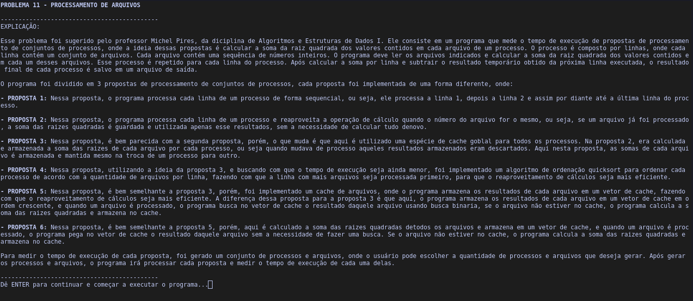
    <figcaption>Fonte: Autor - Execução do Programa</figcaption>
    </figure>
</p>
<p align="right"><a href="#-tópicos">⬆️ Voltar para o Sumário</a></p>

### 📑 Gerando Arquivos e Processos
Aqui começa a execução real do programa, onde ele pede as informações de quantos arquivos irá gerar, quantos processos, até quantas linhas terá cada processo, até quantos arquivos terá cada linha de cada processo e por último quantos conjuntos de processos será analisados e quais seus respectivos tamanhos. Veja: 

<p align="center">
    <figure align="center">
    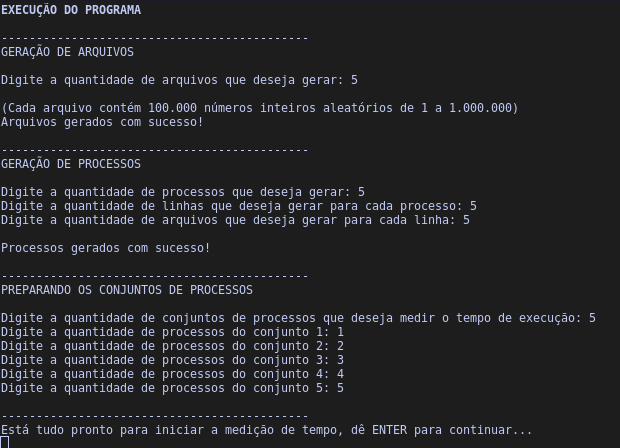
    <figcaption>Fonte: Autor - Execução do Programa</figcaption>
    </figure>
</p>
<p align="right"><a href="#-tópicos">⬆️ Voltar para o Sumário</a></p>

### ⏱️ Medição do Tempo de Execução das Propostas 
Depois, já se inicia a contagem de tempo da execução de cada proposta com a quantidade de conjuntos de processos que vc selecionou. 

<p align="center">
    <figure align="center">
    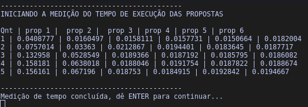
    <figcaption>Fonte: Autor - Execução do Programa</figcaption>
    </figure>
</p>
<p align="right"><a href="#-tópicos">⬆️ Voltar para o Sumário</a></p>

### 📄 Arquivo `output.txt`
No arquivo `output.txt`, é guardado os valores das subtração das somas das raízes quadradas de cada linha de cada processo. Veja um exemplo da saída desse arquivo:

```txt
    -599813054
    -732694521
    -998823930
    -399758306
    -66607134
```
<p align="right"><a href="#-tópicos">⬆️ Voltar para o Sumário</a></p>

### 📄 Arquivo `tempos_execução.csv`
É guardado os tempos de execução no arquivo `tempos_execucao.cvs`, para que possa ser usado depois para fazer a plotagem do gráfico. 
```csv
    QuantidadeConjuntos,Proposta1,Proposta2,Proposta3,Proposta4,Proposta5,Proposta6
    1,0.0408777,0.0160497,0.0158111,0.0157731,0.0150664,0.0182004
    2,0.0757014,0.03363,0.0212867,0.0194401,0.0183645,0.0187717
    3,0.132958,0.0528549,0.0189366,0.0187192,0.0185795,0.0186082
    4,0.158181,0.0638018,0.0188046,0.0191754,0.0187822,0.0188674
    5,0.156161,0.067196,0.018753,0.0184915,0.0192842,0.0194667
```
<p align="right"><a href="#-tópicos">⬆️ Voltar para o Sumário</a></p>

### 📊 Gerando Gráfico
Depois de salvar os dados no arquvivo `tempos_execução.csv`, é feita a plotagem do gráfico em uma página do navegador. 

<p align="center">
    <figure align="center">
    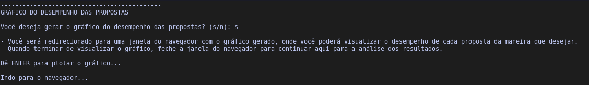
    <figcaption>Fonte: Autor - Execução do Programa</figcaption>
    </figure>
</p>

No navegador irá aparecer o gráfico plotado para a análise: 

<p align="center">
    <figure align="center">
    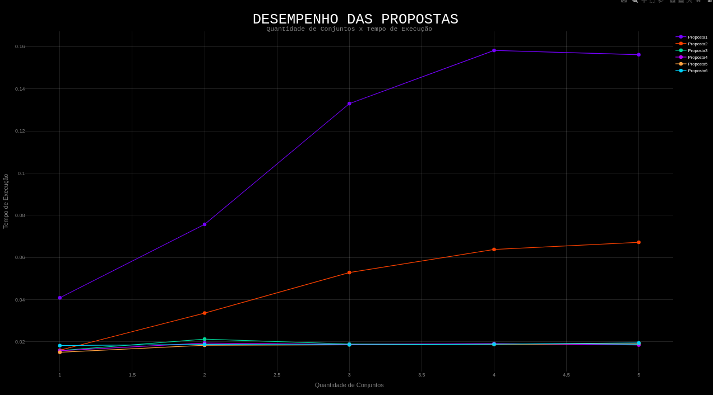
    <figcaption>Fonte: Autor - Gráfico</figcaption>
    </figure>
</p>

Na parte superior direita do gráfico tem uma legenda onde mostra as linhas de cada proposta, tem como ocultar algumas linhas para a melhor visualização: 

<table>
    <tr>
        <td>
    <p align="center">
        <figure align="center">
            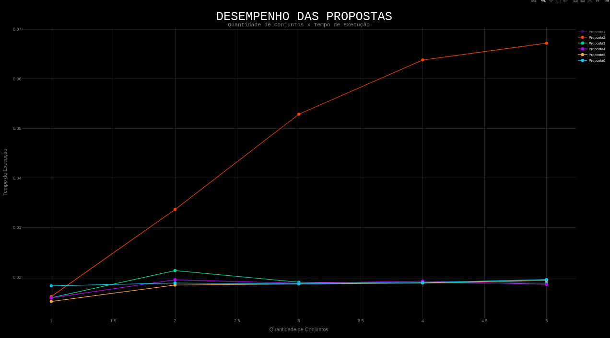
            <figcaption>Fonte: Autor - Gráfico</figcaption>
        </figure>
</p>
        </td>
        <td>
    <p align="center">
        <figure align="center">
            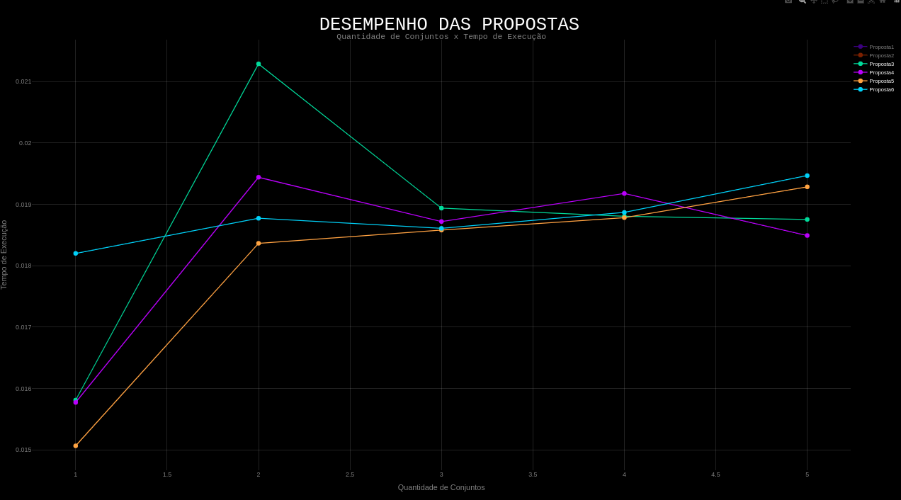
            <figcaption>Fonte: Autor - Gráfico</figcaption>
        </figure>
</p>
        </td>
    </tr>
</table>

<table>
    <tr>
        <td>
    <p align="center">
        <figure align="center">
            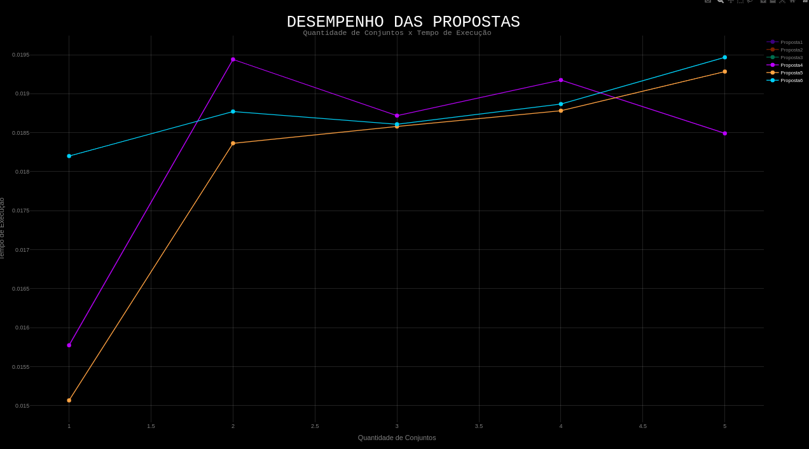
            <figcaption>Fonte: Autor - Gráfico</figcaption>
        </figure>
</p>
        </td>
        <td>
    <p align="center">
        <figure align="center">
            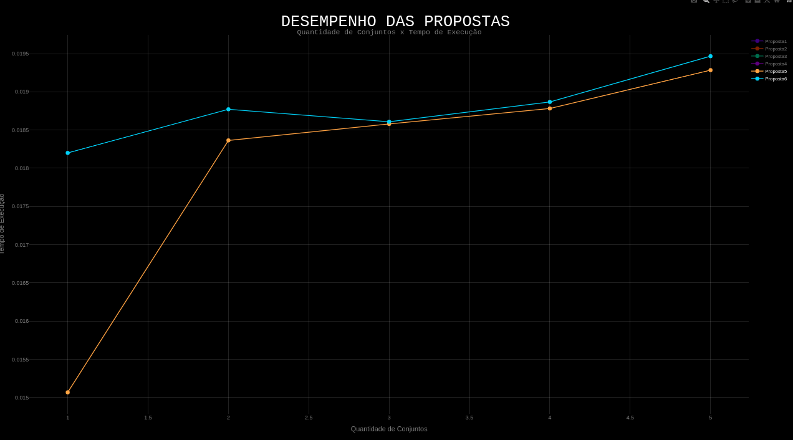
            <figcaption>Fonte: Autor - Gráfico</figcaption>
        </figure>
</p>
        </td>
    </tr>
</table>

Depois que terminar de visualizar o gráfico, volte para o programa para continuar a sua execução

<p align="center">
    <figure align="center">
    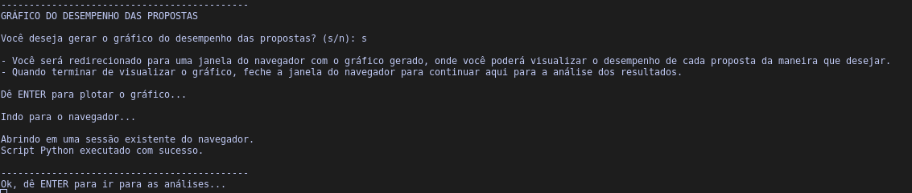
    <figcaption>Fonte: Autor - Execução do Programa</figcaption>
    </figure>
</p>
<p align="right"><a href="#-tópicos">⬆️ Voltar para o Sumário</a></p>

### 📈 Análise de Resultados 
Nesta parte é feito um pequeno estudo e explicação de cada proposta, apresentando como é esperado o desempenho de cada uma: 

<p align="center">
    <figure align="center">
    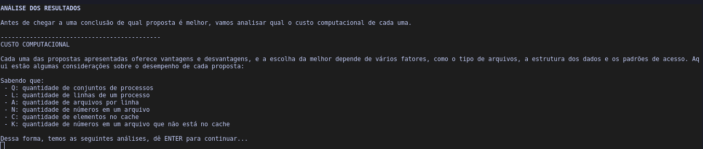
    <figcaption>Fonte: Autor - Execução do Programa</figcaption>
    </figure>
</p>

Depois apresenta a complexidade, descrição, melhoria e limitação de cada proposta:

<p align="center">
    <figure align="center">
    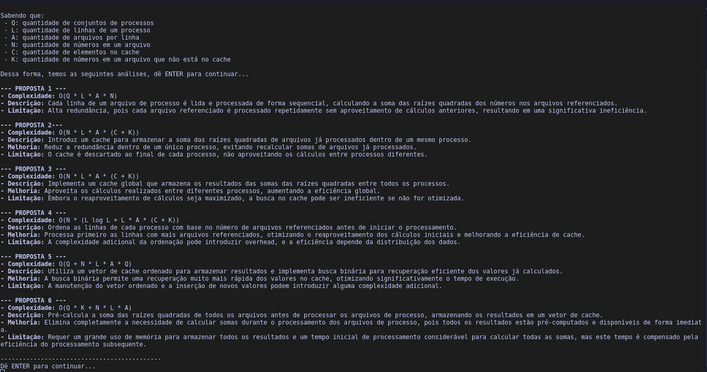
    <figcaption>Fonte: Autor - Execução do Programa</figcaption>
    </figure>
</p>

Logo após, é faldo mais um pouco sobre a eficiência de cada uma e o motivo de não buscar outras propostas.

<p align="center">
    <figure align="center">
    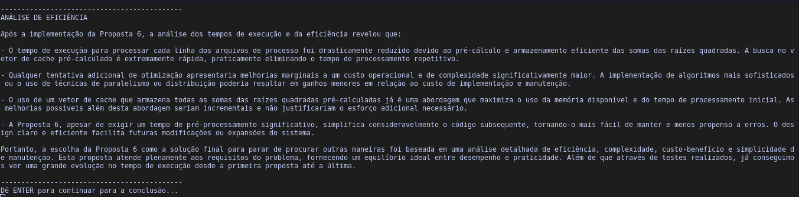
    <figcaption>Fonte: Autor - Execução do Programa</figcaption>
    </figure>
</p>

E por fim tem a conclusão das análises: 

<p align="center">
    <figure align="center">
    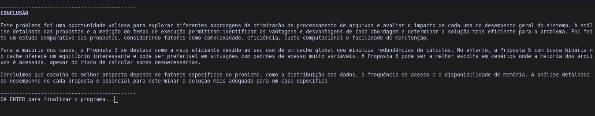
    <figcaption>Fonte: Autor - Execução do Programa</figcaption>
    </figure>
</p>
<p align="right"><a href="#-tópicos">⬆️ Voltar para o Sumário</a></p>

### 🙏 Agradecimento e dados

No final, é feito o agradecimento e mostra alguns dados:

<p align="center">
    <figure align="center">
    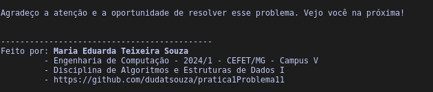
    <figcaption>Fonte: Autor - Execução do Programa</figcaption>
    </figure>
</p>
<p align="right"><a href="#-tópicos">⬆️ Voltar para o Sumário</a></p>


## 📈 Análises, Testes e Estudos
Foram feitos alguns testes para que possamos ver o comportamento de cada proposta de acordo com diferentes tipos de entradas dos números de processos, arquivos, linhas e conjuntos de processos. Foram feitos os seguintes testes:

1. Utilizando os mesmo valores para quantidade de processos, arquivos, linhas e arquivos por linha
2. Utilizando valores maiores de processos do que arquivos, linhas e arquivos por linha
3. Utilizando valores maiores de arquivos do que processos, linhas e arquivos por linha
4. Utilizando valores maiores de linhas do que processos, arquivos e arquivos por linha
5. Utilizando valores maiores de arquivos por linha do que processos, arquivos e linhas 

É importante lembrar que o números de linhas de cada processo é gerado aleatóriamente com valores de 1 até o valor que estiver digitado, isso acontece tbm para a quantidade de arquivos por linha. Vamos ver que exemplo disso logo abaixo. 
<p align="right"><a href="#-tópicos">⬆️ Voltar para o Sumário</a></p>

### 🔼🔽  Mesmo valores para quantidade de processos, arquivos, linhas e arquivos por linha
Vamos fazer com 4 valores diferentes (1, 10, 50, 100).. 

- **Primeiro teste (1):** Primeiro colocamos o valor que nós queremos: 
<p align="center">
    <figure align="center">
    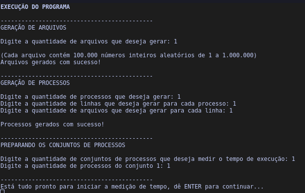
    <figcaption>Fonte: Autor - Teste com todos os valores iguais (1)</figcaption>
    </figure>
</p>

    Depois, é executado os cálculos e plotado o gráfico: 
<p align="center">
    <figure align="center">
    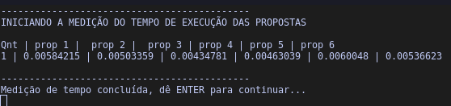
    <figcaption>Fonte: Autor - Teste com todos os valores iguais (1)</figcaption>
    </figure>
</p>
<p align="center">
    <figure align="center">
    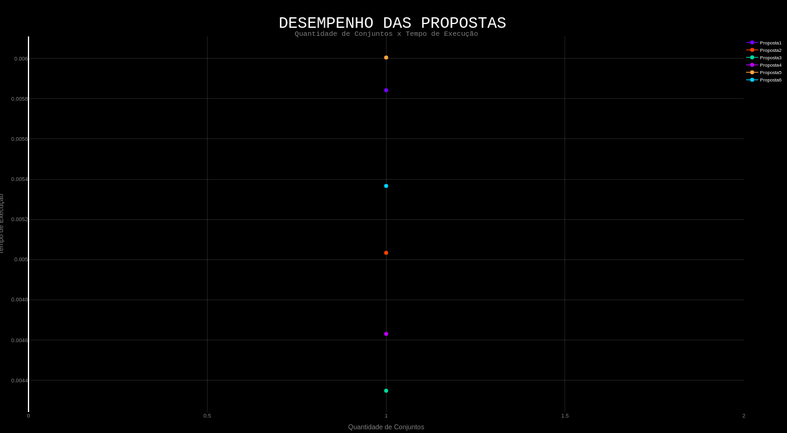
    <figcaption>Fonte: Autor - Teste com todos os valores iguais (1)</figcaption>
    </figure>
</p>
    
    Vemos que os valores deram muito parecido pois, como todos os valores são um, faz com que tudo seja calculados uma vez e isso resulta em em tempos de execução parecidos. 
<p align="right"><a href="#-tópicos">⬆️ Voltar para o Sumário</a></p>

- **Segundo teste (10):** Repetimos o processo navamente, colocamos o valor que nós queremos: 
<p align="center">
    <figure align="center">
    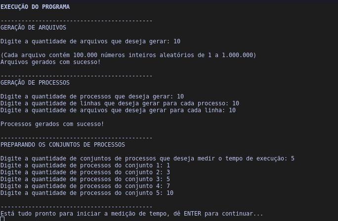
    <figcaption>Fonte: Autor - Teste com todos os valores iguais (10)</figcaption>
    </figure>
</p>

    Depois, é executado os cálculos e plotado o gráfico: 
<p align="center">
    <figure align="center">
    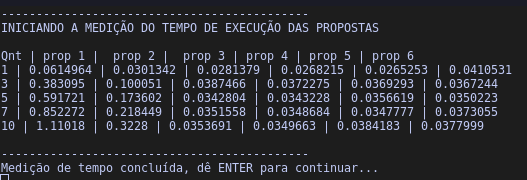
    <figcaption>Fonte: Autor - Teste com todos os valores iguais (10)</figcaption>
    </figure>
</p>
<p align="center">
    <figure align="center">
    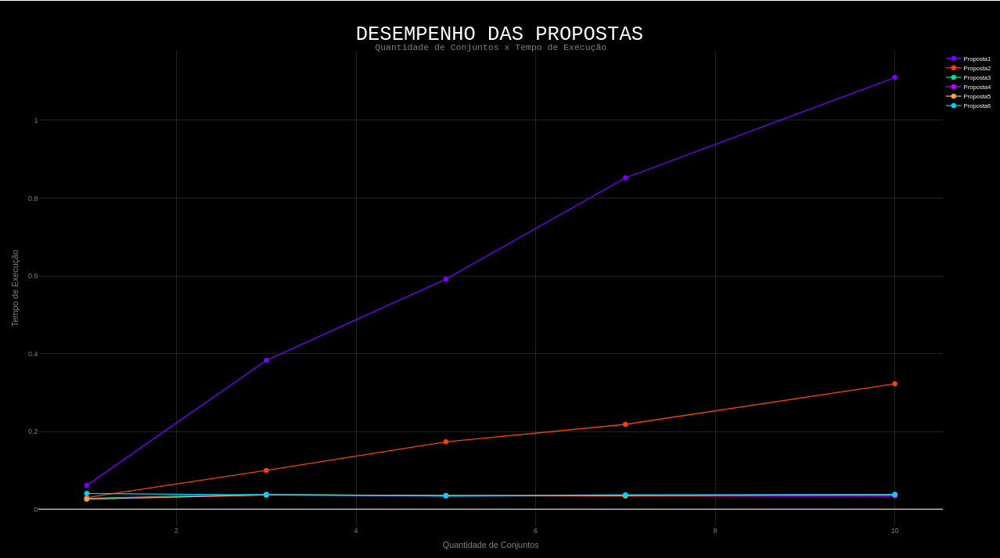
    <figcaption>Fonte: Autor - Teste com todos os valores iguais (10)</figcaption>
    </figure>
</p>
    
    Como os valores das Proposta 3 até a Proprota 6 deram muito próximos, ocultamos os valores das Propostas 1 e 2, para uma melhor visualização das outras propostas. 
<p align="center">
    <figure align="center">
    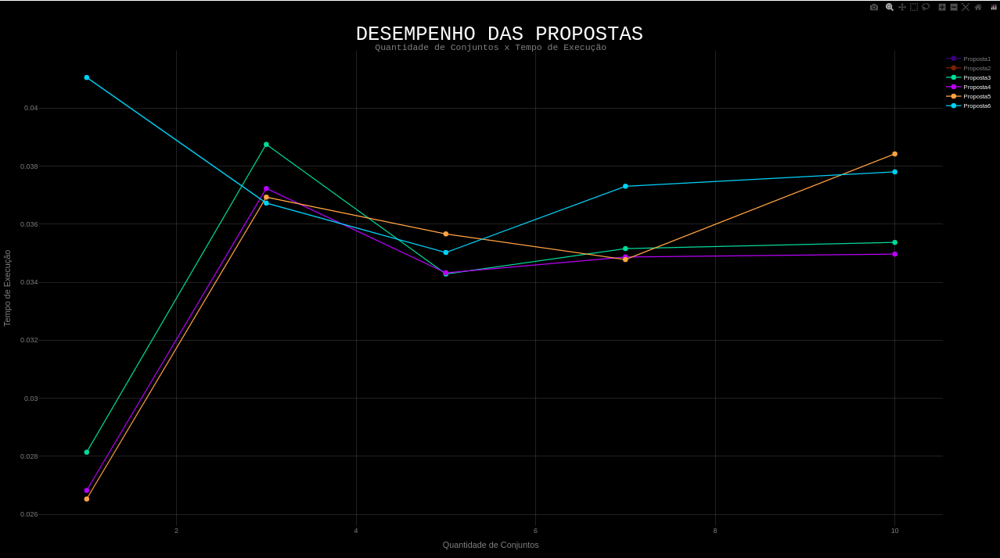
    <figcaption>Fonte: Autor - Teste com todos os valores iguais (10)</figcaption>
    </figure>
</p>

    Aqui já vemos uma grande diferença entre os valores das propostas, principalmente da 1 e a 2 em relação as demais. 
<p align="right"><a href="#-tópicos">⬆️ Voltar para o Sumário</a></p>

- **Terceiro teste (50):** Primeiro colocamos o valor que nós queremos: 
<p align="center">
    <figure align="center">
    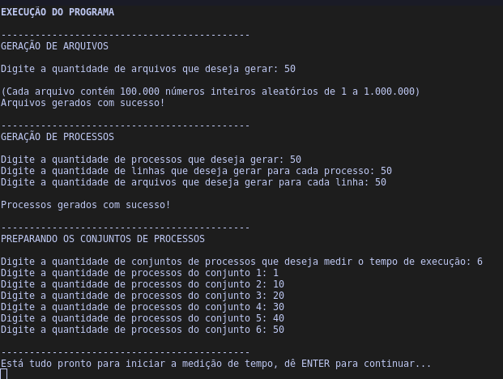
    <figcaption>Fonte: Autor - Teste com todos os valores iguais (50)</figcaption>
    </figure>
</p>

    Depois, é executado os cálculos e plotado o gráfico: 
<p align="center">
    <figure align="center">
    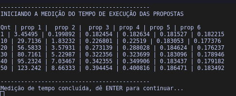
    <figcaption>Fonte: Autor - Teste com todos os valores iguais (50)</figcaption>
    </figure>
</p>
<p align="center">
    <figure align="center">
    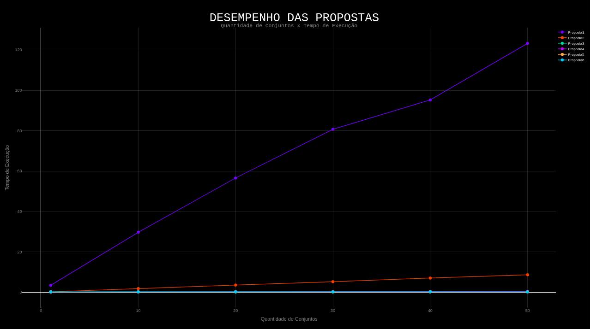
    <figcaption>Fonte: Autor - Teste com todos os valores iguais (50)</figcaption>
    </figure>
</p>
    
    Para uma melhor visualização de todas as propostas, ocultamos as Proposta 1 e 2.
<p align="center">
    <figure align="center">
    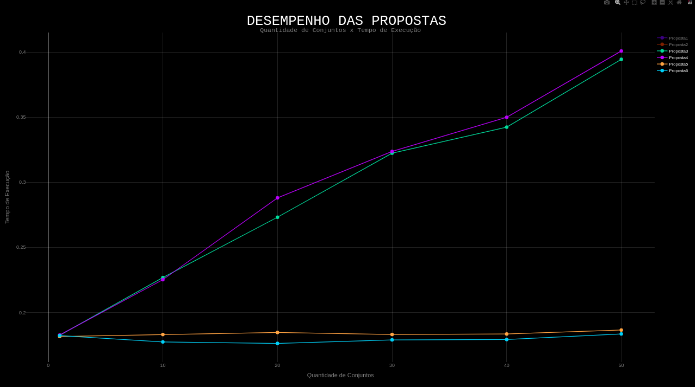
    <figcaption>Fonte: Autor - Teste com todos os valores iguais (50)</figcaption>
    </figure>
</p>

    Observe a grande diferença entre as Proposta 1 e 2 com as demais propostas, depois a diferença entre as Propostas 3 e 4 com as Propostas 5 e 6.
<p align="right"><a href="#-tópicos">⬆️ Voltar para o Sumário</a></p>

- **Quarto teste (100):** Primeiro colocamos o valor que nós queremos: 
<p align="center">
    <figure align="center">
    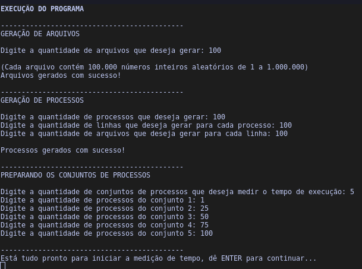
    <figcaption>Fonte: Autor - Teste com todos os valores iguais (100)</figcaption>
    </figure>
</p>

    Depois, é executado os cálculos e plotado o gráfico: 
<p align="center">
    <figure align="center">
    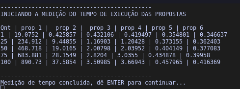
    <figcaption>Fonte: Autor - Teste com todos os valores iguais (100)</figcaption>
    </figure>
</p>
<p align="center">
    <figure align="center">
    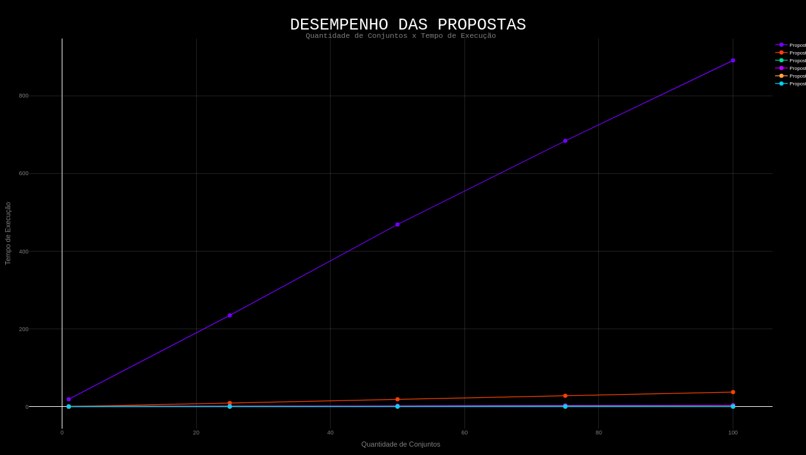
    <figcaption>Fonte: Autor - Teste com todos os valores iguais (100)</figcaption>
    </figure>
</p>
    
    Ocultamos as Proposta 1 e 2, para uma melhor visualização de todas as propostas.
<p align="center">
    <figure align="center">
    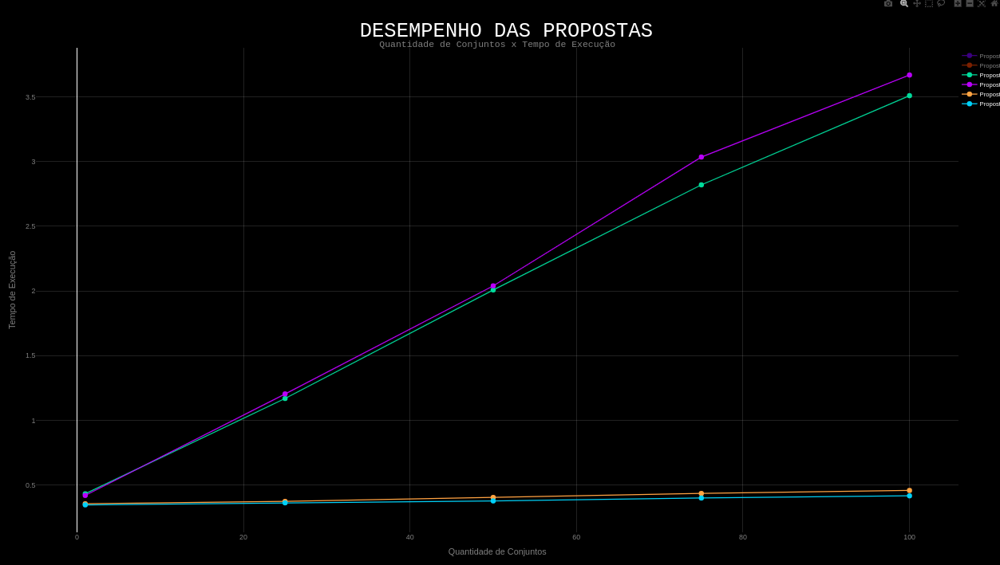
    <figcaption>Fonte: Autor - Teste com todos os valores iguais (100)</figcaption>
    </figure>
</p>
    
    Percebemos que quanto mais aumentamos os valores a diferença de tempo entre as propostas aumenta cada vez mais, principalmente entre as Propostas 1 para as demais, o mesmo com a Proposta 2 com as demais. Podemos visualizar um bom desempenho das proposta 5 e 6, que consegue manter seus valores parecidos mesmo aumentando a quantidade de processos.

Com todos os valores iguais vemos que a cada vez q aumentamos as entradas as Propostas 5 e 6 se destacam. Podemos observar principalmente quando colocamos a entrada (100) com vários conjuntos de processos diferentes, percebemos que essas propostas, mesmo que aumentasse a quantidade de conjuntos tiveram uma diferença muito baixa. Isso já nos mostra uma boa eficiência e um destaque delas em relação as outras propostas. Vamos ver outros testes.
<p align="right"><a href="#-tópicos">⬆️ Voltar para o Sumário</a></p>

### 🔼🔽 Valores maiores de processos do que arquivos, linhas e arquivos por linha
Aqui vamos fazer com 3 testes: 

- **Primeiro teste (50 processos, valor igual a 10 para as outras entradas):** Inserindo valores de entrada: 

<p align="center">
    <figure align="center">
    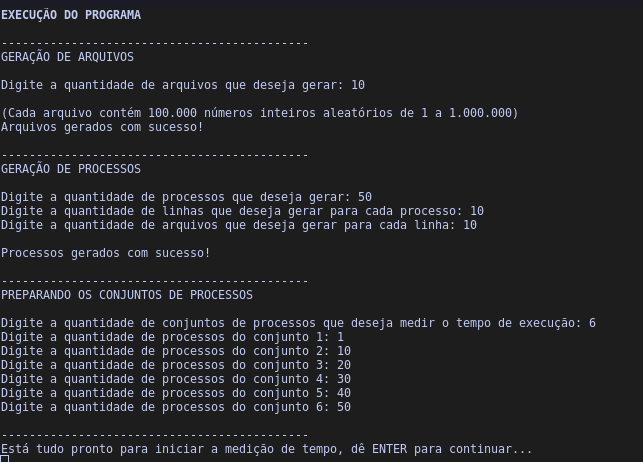
    <figcaption>Fonte: Autor - Teste com valores de processos maiores (50)</figcaption>
    </figure>
</p>

    Depois, é executado os cálculos e plotado o gráfico: 
<p align="center">
    <figure align="center">
    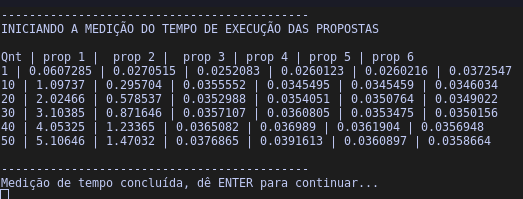
    <figcaption>Fonte: Autor - Teste com valores de processos maiores (50)</figcaption>
    </figure>
</p>
<p align="center">
    <figure align="center">
    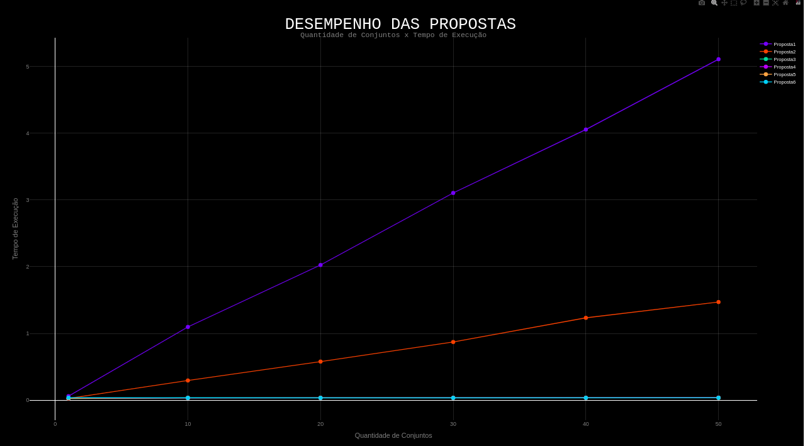
    <figcaption>Fonte: Autor - Teste com valores de processos maiores (50)</figcaption>
    </figure>
</p>
    
    Ocultamos as Proposta 1 e 2, para uma melhor visualização de todas as propostas.
<p align="center">
    <figure align="center">
    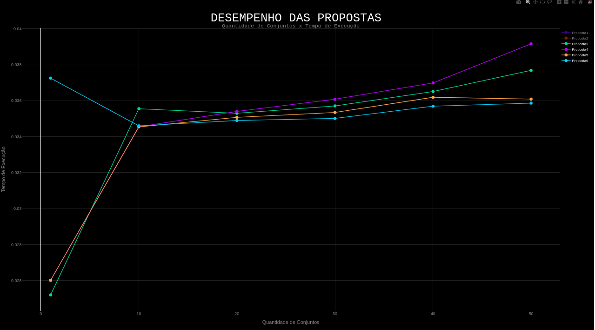
    <figcaption>Fonte: Autor - Teste com valores de processos maiores (50)</figcaption>
    </figure>
</p>
    
    Aqui mesmo com um grande aumento da quantidade de processos vemos que se mantém o tempo de execução bem próximo das Propostas 3 a 6.
<p align="right"><a href="#-tópicos">⬆️ Voltar para o Sumário</a></p>

- **Segundo teste (100 processos, valor igual a 10 para as outras entradas):** Inserindo valores de entrada: 

<p align="center">
    <figure align="center">
    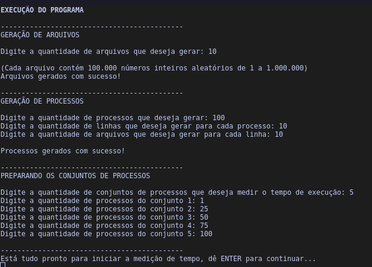
    <figcaption>Fonte: Autor - Teste com valores de processos maiores (100)</figcaption>
    </figure>
</p>

    Depois, é executado os cálculos e plotado o gráfico: 
<p align="center">
    <figure align="center">
    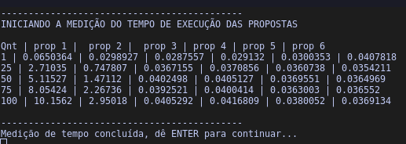
    <figcaption>Fonte: Autor - Teste com valores de processos maiores (100)</figcaption>
    </figure>
</p>
<p align="center">
    <figure align="center">
    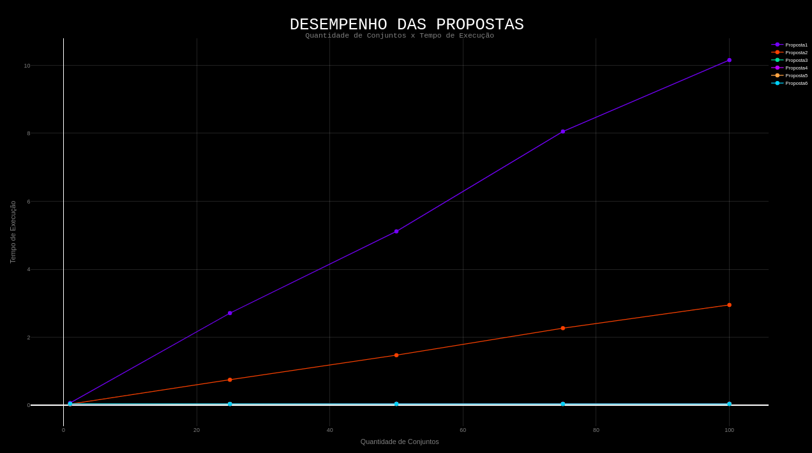
    <figcaption>Fonte: Autor - Teste com valores de processos maiores (100)</figcaption>
    </figure>
</p>
    
    Ocultamos as Proposta 1 e 2, para uma melhor visualização de todas as propostas.
<p align="center">
    <figure align="center">
    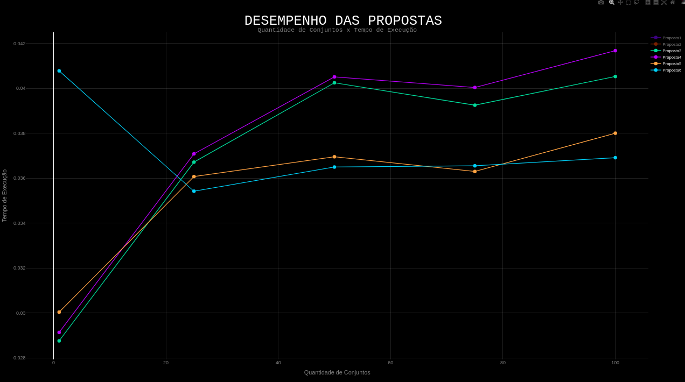
    <figcaption>Fonte: Autor - Teste com valores de processos maiores (100)</figcaption>
    </figure>
</p>
    
    Vemos que aqui existe uma pequena distância entre as Propostas 3 e 4 em relação as Propostas 5 e 6, mas mesmo assim elas continuam tendo tempos parecidos. 
<p align="right"><a href="#-tópicos">⬆️ Voltar para o Sumário</a></p>

- **Terceiro teste (1000 processos, valor igual a 10 para as outras entradas):** Inserindo valores de entrada: 

<p align="center">
    <figure align="center">
    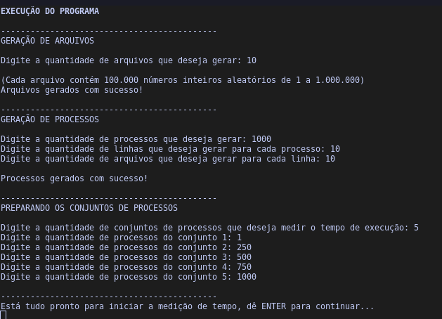
    <figcaption>Fonte: Autor - Teste com valores de processos maiores (1000)</figcaption>
    </figure>
</p>

    Depois, é executado os cálculos e plotado o gráfico: 
<p align="center">
    <figure align="center">
    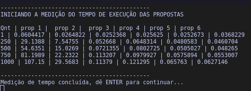
    <figcaption>Fonte: Autor - Teste com valores de processos maiores (1000)</figcaption>
    </figure>
</p>
<p align="center">
    <figure align="center">
    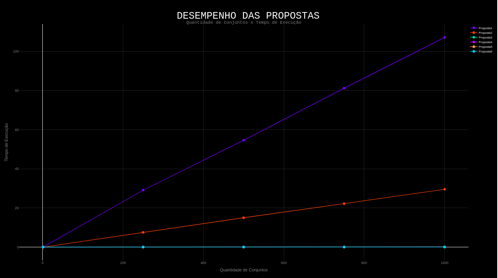
    <figcaption>Fonte: Autor - Teste com valores de processos maiores (1000)</figcaption>
    </figure>
</p>
    
    Ocultamos as Proposta 1 e 2, para uma melhor visualização de todas as propostas.
<p align="center">
    <figure align="center">
    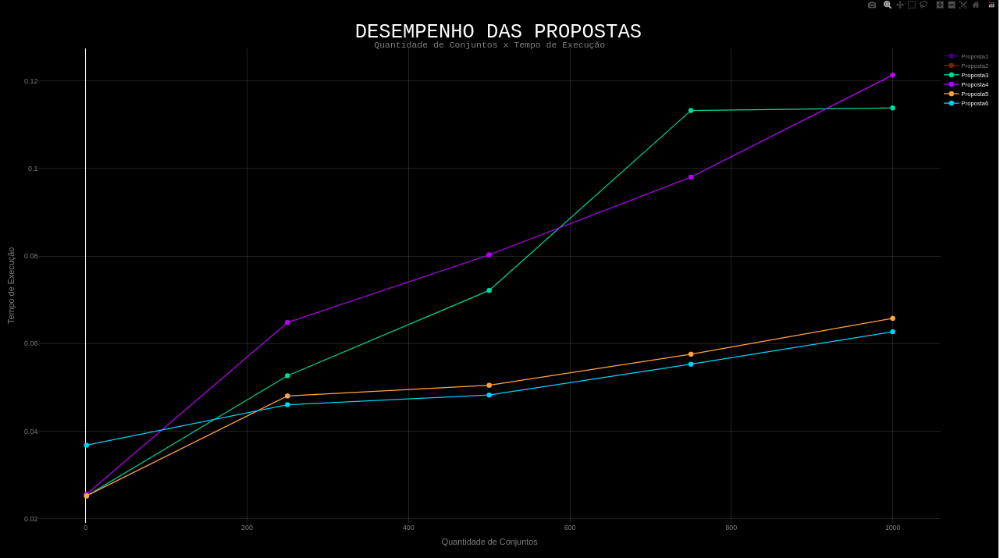
    <figcaption>Fonte: Autor - Teste com valores de processos maiores (1000)</figcaption>
    </figure>
</p>
    
    Mesmo com valores muito maiores que os outros testes os valores continuaram parecidos com os padrões que já tinhamos observado.

Aqui, conseguimos ver que quantidade de processos não interfiriu tanto no que tinhamos observado nos testes anteriores. Vemos que tem uma grande discrepância da Proposta 1 com as demais, o mesmo com a Proposta 2. Depois as outras propostas tem seus valores parecidos, porém quanto mais vamos aumentando os valores, as Propostas 3 e 4 vão se distanciando das Propostas 5 e 6, e entre todas a Proposta 6 se mostra com mais eficiência. 
<p align="right"><a href="#-tópicos">⬆️ Voltar para o Sumário</a></p>

### 🔼🔽 Valores maiores de arquivos do que processos, linhas e arquivos por linha
Aqui vamos fazer com 3 testes: 

- **Primeiro teste (50 arquivos, valor igual a 10 para as outras entradas):** Inserindo valores de entrada: 

<p align="center">
    <figure align="center">
    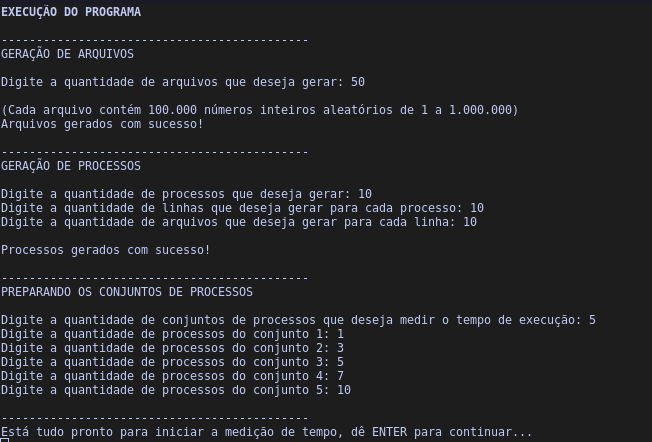
    <figcaption>Fonte: Autor - Teste com valores de arquivos maiores (50)</figcaption>
    </figure>
</p>

    Depois, é executado os cálculos e plotado o gráfico: 
<p align="center">
    <figure align="center">
    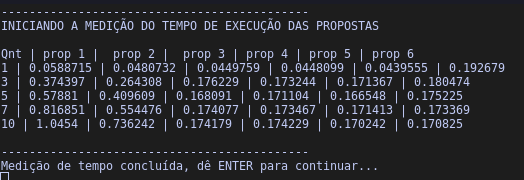
    <figcaption>Fonte: Autor - Teste com valores de arquivos maiores (50)</figcaption>
    </figure>
</p>
<p align="center">
    <figure align="center">
    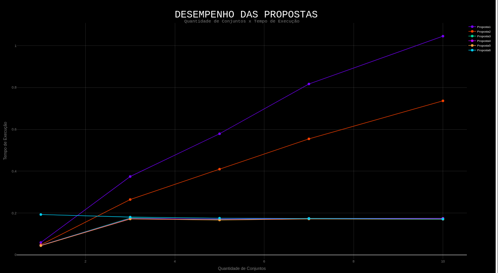
    <figcaption>Fonte: Autor - Teste com valores de arquivos maiores (50)</figcaption>
    </figure>
</p>
    
    Como fizemos das outras vezes, ocultamos as Propostas 1 e2.
<p align="center">
    <figure align="center">
    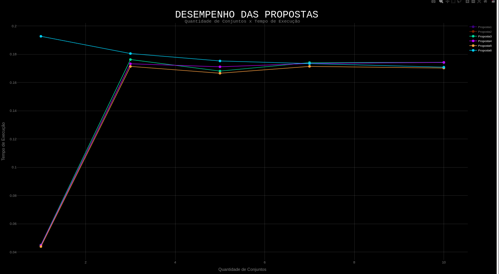
    <figcaption>Fonte: Autor - Teste com valores de arquivos maiores (50)</figcaption>
    </figure>
</p>
    
    Vemos que continua o mesmo padrão dos outros testes.
<p align="right"><a href="#-tópicos">⬆️ Voltar para o Sumário</a></p>

- **Segundo teste (100 arquivos, valor igual a 10 para as outras entradas):** Inserindo valores de entrada: 

<p align="center">
    <figure align="center">
    
    <figcaption>Fonte: Autor - Teste com valores de arquivos maiores (100)</figcaption>
    </figure>
</p>

    Depois, é executado os cálculos e plotado o gráfico: 
<p align="center">
    <figure align="center">
    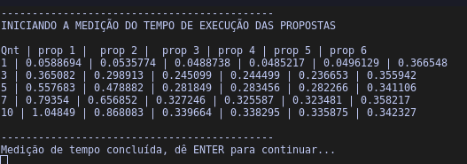
    <figcaption>Fonte: Autor - Teste com valores de arquivos maiores (100)</figcaption>
    </figure>
</p>
<p align="center">
    <figure align="center">
    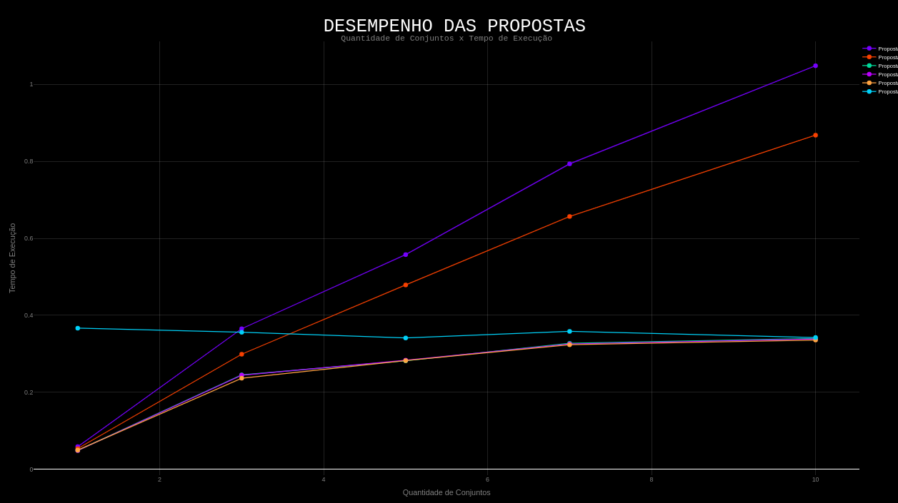
    <figcaption>Fonte: Autor - Teste com valores de arquivos maiores (100)</figcaption>
    </figure>
</p>
    
    Novamente ocultando as Propostas 1 e 2.
<p align="center">
    <figure align="center">
    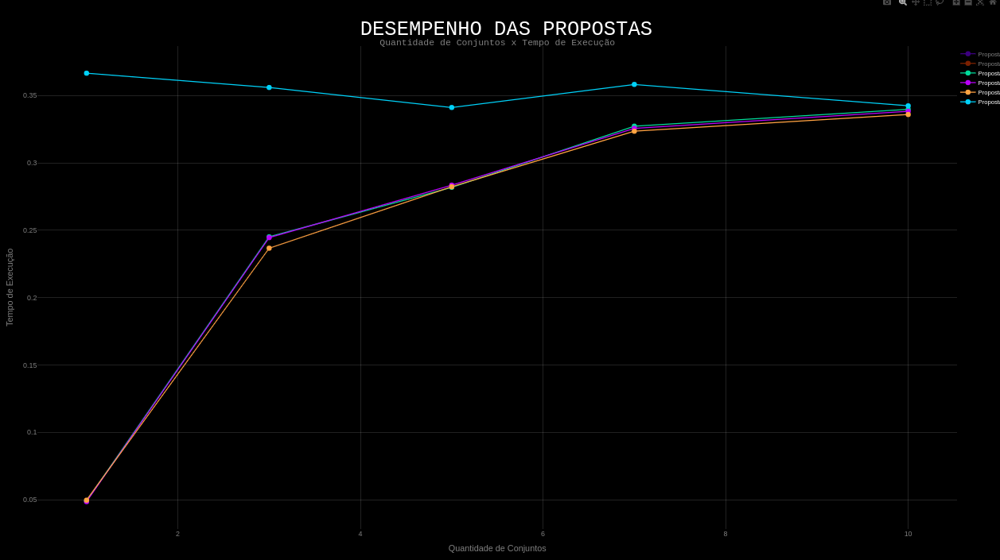
    <figcaption>Fonte: Autor - Teste com valores de arquivos maiores (100)</figcaption>
    </figure>
</p>
    
    Neste vemos algo interressante, nos demais teste a Proposta 6 vem se destacando por sua boa performace, porém aqui isso mudou um pouco.
<p align="right"><a href="#-tópicos">⬆️ Voltar para o Sumário</a></p> 

- **Terceiro teste (1000 arquivos, valor igual a 10 para as outras entradas):** Inserindo valores de entrada: 

<p align="center">
    <figure align="center">
    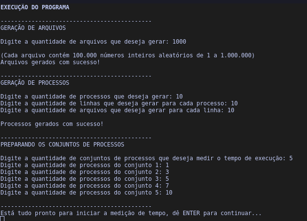
    <figcaption>Fonte: Autor - Teste com valores de arquivos maiores (1000)</figcaption>
    </figure>
</p>

    Depois, é executado os cálculos e plotado o gráfico: 
<p align="center">
    <figure align="center">
    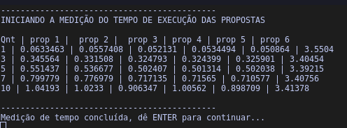
    <figcaption>Fonte: Autor - Teste com valores de arquivos maiores (1000)</figcaption>
    </figure>
</p>
<p align="center">
    <figure align="center">
    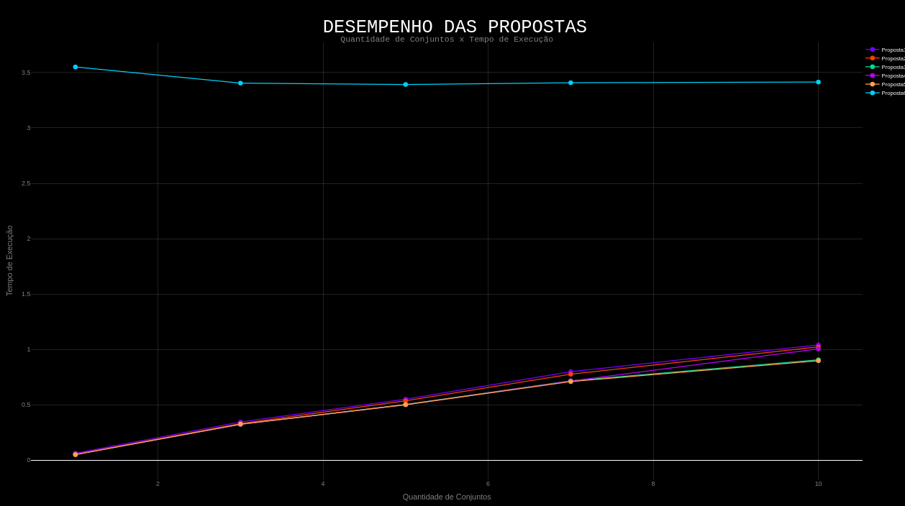
    <figcaption>Fonte: Autor - Teste com valores de arquivos maiores (1000)</figcaption>
    </figure>
</p>
    
    Diferentes das outras, aqui tivemos que ocultar a Proposta 6, para visualizar melhor as outras. 
<p align="center">
    <figure align="center">
    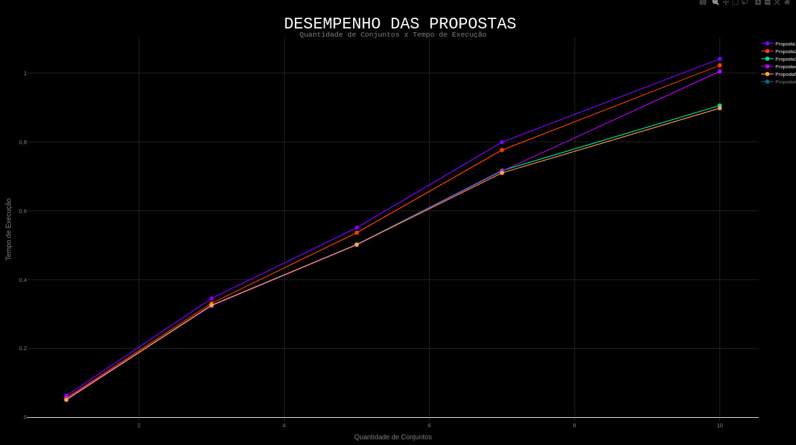
    <figcaption>Fonte: Autor - Teste com valores de arquivos maiores (1000)</figcaption>
    </figure>
</p>
    
    Observamos que tivemos um cenário diferente, dos outros testes. 

Já era esperado que a Proposta 6 não seria uma boa opção para esse caso, pois esta proposta calcula todos os arquivos para depois olhar quais seriam necessários e exigidos pelos processos. Aqui, neste caso, aumentamos o número de arquivos, e mantemos os outros valores baixo e isso fez com que muitos dos arquivos não fossem nem utilizados, isso fez com que a Proposta 6 não se destacasse como uma boa opção.
<p align="right"><a href="#-tópicos">⬆️ Voltar para o Sumário</a></p>

### 🔼🔽 Valores maiores de linhas do que processos, arquivos e arquivos por linha
Aqui vamos fazer com 3 testes: 

- **Primeiro teste (50 linhas, valor igual a 10 para as outras entradas):** Inserindo valores de entrada: 

<p align="center">
    <figure align="center">
    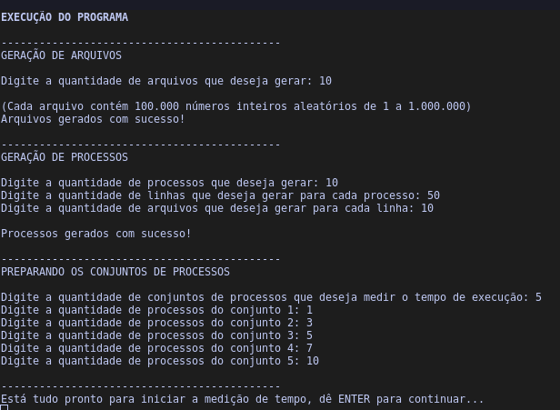
    <figcaption>Fonte: Autor - Teste com valores de linhas maiores (50)</figcaption>
    </figure>
</p>

    Depois, é executado os cálculos e plotado o gráfico: 
<p align="center">
    <figure align="center">
    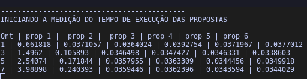
    <figcaption>Fonte: Autor - Teste com valores de linhas maiores (50)</figcaption>
    </figure>
</p>
<p align="center">
    <figure align="center">
    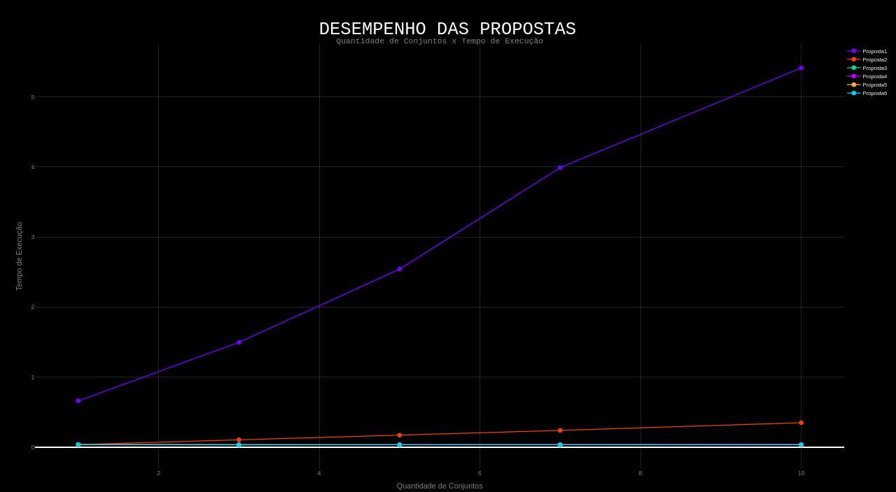
    <figcaption>Fonte: Autor - Teste com valores de linhas maiores (50)</figcaption>
    </figure>
</p>
    
    Repetindo o processo de ocultar algumas proposta para visualizarmos melhor.
<p align="center">
    <figure align="center">
    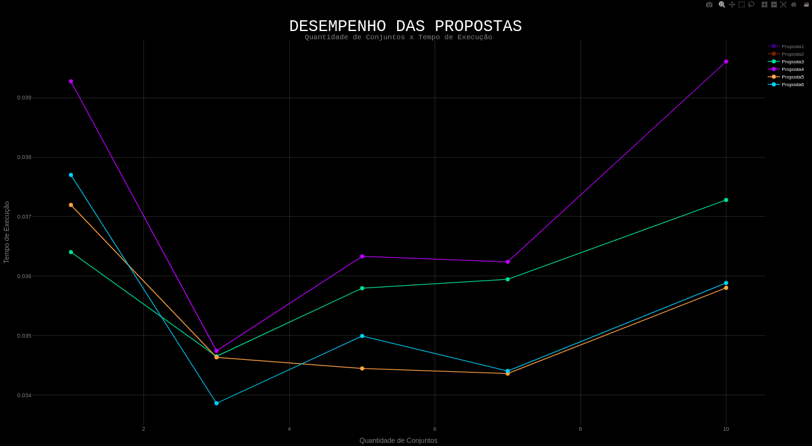
    <figcaption>Fonte: Autor - Teste com valores de linhas maiores (50)</figcaption>
    </figure>
</p>
    
    Aqui o desempenho da Proposta 1 se mostra pior do que os outros testes.
<p align="right"><a href="#-tópicos">⬆️ Voltar para o Sumário</a></p>

- **Segundo teste (100 linhas, valor igual a 10 para as outras entradas):** Inserindo valores de entrada: 

<p align="center">
    <figure align="center">
    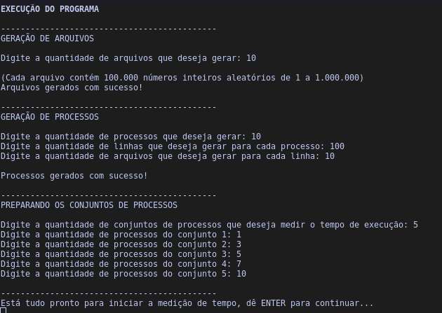
    <figcaption>Fonte: Autor - Teste com valores de linhas maiores (100)</figcaption>
    </figure>
</p>

    Depois, é executado os cálculos e plotado o gráfico: 
<p align="center">
    <figure align="center">
    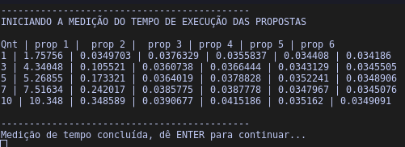
    <figcaption>Fonte: Autor - Teste com valores de linhas maiores (100)</figcaption>
    </figure>
</p>
<p align="center">
    <figure align="center">
    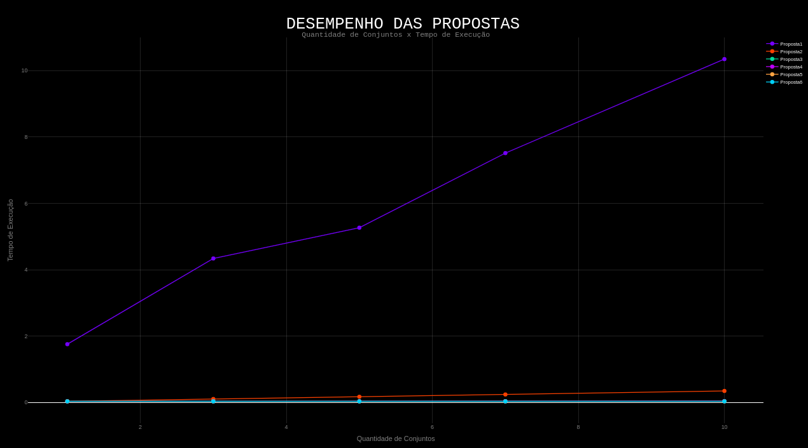
    <figcaption>Fonte: Autor - Teste com valores de linhas maiores (100)</figcaption>
    </figure>
</p>
    
    Ocultamos algumas propostas.
<p align="center">
    <figure align="center">
    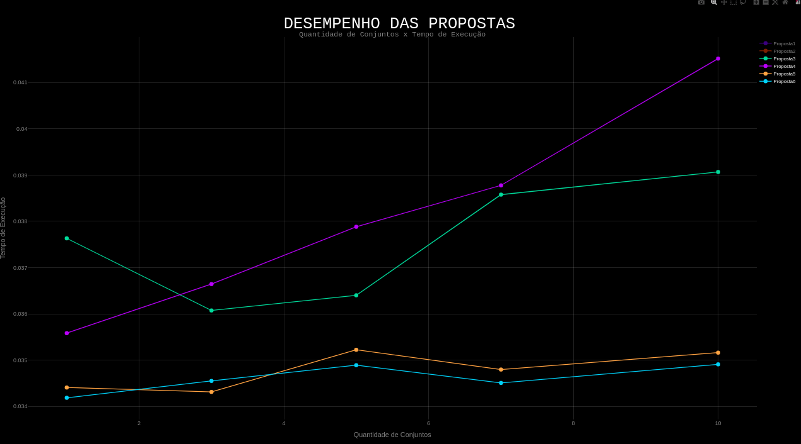
    <figcaption>Fonte: Autor - Teste com valores de linhas maiores (100)</figcaption>
    </figure>
</p>
    
    Aqui a Proposta 1 piora ainda mais.
<p align="right"><a href="#-tópicos">⬆️ Voltar para o Sumário</a></p>

- **Terceiro teste (1000 linhas, valor igual a 10 para as outras entradas):** Inserindo valores de entrada: 

<p align="center">
    <figure align="center">
    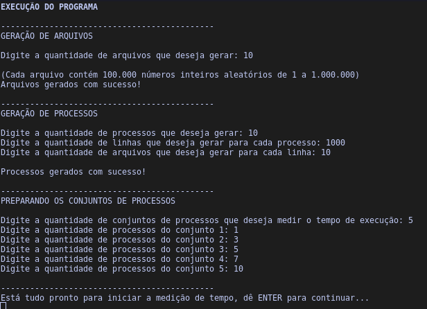
    <figcaption>Fonte: Autor - Teste com valores de linhas maiores (1000)</figcaption>
    </figure>
</p>

    Depois, é executado os cálculos e plotado o gráfico: 
<p align="center">
    <figure align="center">
    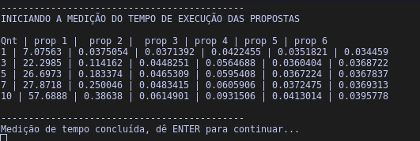
    <figcaption>Fonte: Autor - Teste com valores de linhas maiores (1000)</figcaption>
    </figure>
</p>
<p align="center">
    <figure align="center">
    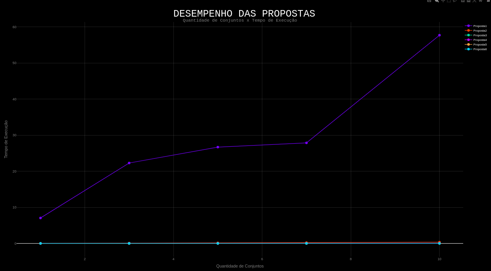
    <figcaption>Fonte: Autor - Teste com valores de linhas maiores (1000)</figcaption>
    </figure>
</p>
    
    Neste vamos ocultar primeiro somente a Proposta 1.
<p align="center">
    <figure align="center">
    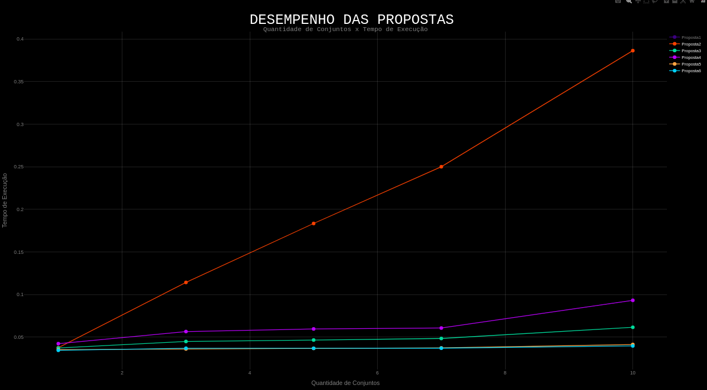
    <figcaption>Fonte: Autor - Teste com valores de linhas maiores (1000)</figcaption>
    </figure>
</p>

    Agora ocultando a Proposta 2 também.
<p align="center">
    <figure align="center">
    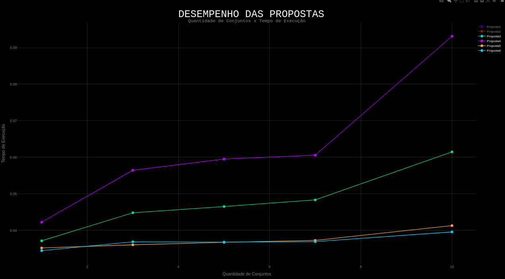
    <figcaption>Fonte: Autor - Teste com valores de linhas maiores (1000)</figcaption>
    </figure>
</p>
    
    Mesmo com a piora na performace da Proposta 1, ainda sim a Proposta 5 e 6 se mostram mais eficientes e com um desempenho melhor a cada vez que aumentamos os valores. 

Analisando bem a Proposta 1 piorou neste caso pelo fato de ela analisar um arquivo de cada vez sem armazenar nenhuma soma e cada linha tem vários arquivos, e quando colocamos valores muito grandes na quantidade de linhas, faz com que a quantidade de arquivos aumente muito, mesmo que eles sejam repetidos várias vezes, esta proposta calcula todos. 
<p align="right"><a href="#-tópicos">⬆️ Voltar para o Sumário</a></p>


### 🔼🔽 Valores maiores de arquivos por linha do que processos, arquivos e linhas
Aqui vamos fazer com 3 testes: 

- **Primeiro teste (50 arquivos por linha, valor igual a 10 para as outras entradas):** Inserindo valores de entrada: 

<p align="center">
    <figure align="center">
    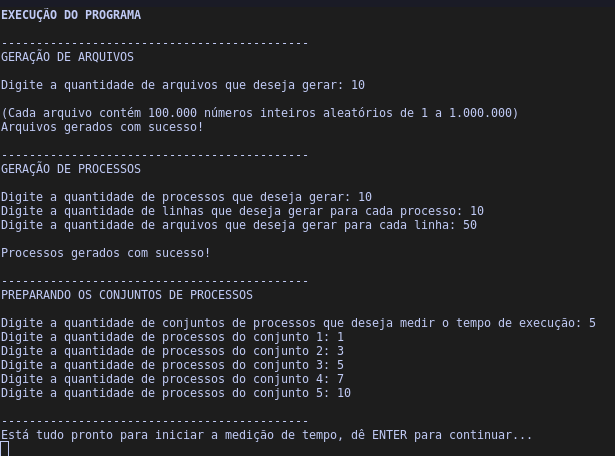
    <figcaption>Fonte: Autor - Teste com valores de arquivos por linha maiores (50)</figcaption>
    </figure>
</p>

    Depois, é executado os cálculos e plotado o gráfico: 
<p align="center">
    <figure align="center">
    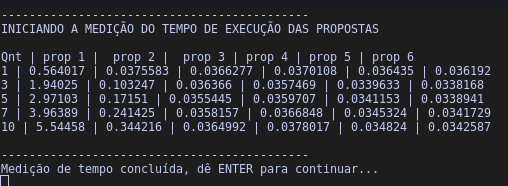
    <figcaption>Fonte: Autor - Teste com valores de arquivos por linha maiores (50)</figcaption>
    </figure>
</p>
<p align="center">
    <figure align="center">
    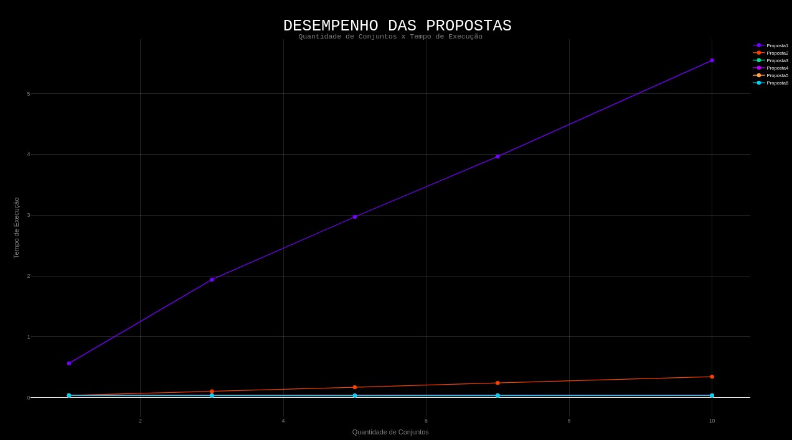
    <figcaption>Fonte: Autor - Teste com valores de arquivos por linha maiores (50)</figcaption>
    </figure>
</p>
    
    Aqui vamos ocultar as Propostas 1 e 2.
<p align="center">
    <figure align="center">
    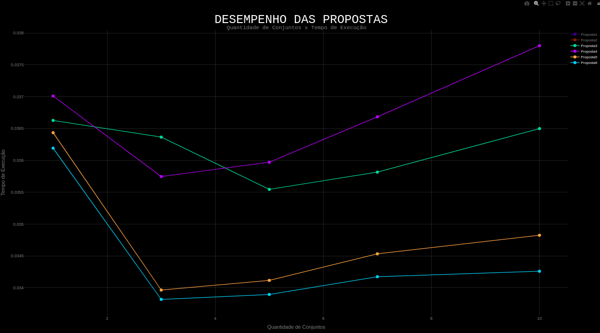
    <figcaption>Fonte: Autor - Teste com valores de arquivos por linha maiores (50)</figcaption>
    </figure>
</p>
    
    Como no teste anterior, a Proposta 1 tem um desempenho pior.
<p align="right"><a href="#-tópicos">⬆️ Voltar para o Sumário</a></p>

- **Segundo teste (100 arquivos por linha, valor igual a 10 para as outras entradas):** Inserindo valores de entrada: 

<p align="center">
    <figure align="center">
    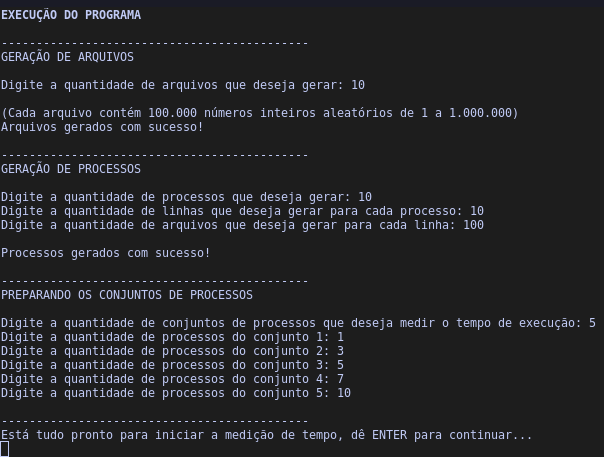
    <figcaption>Fonte: Autor - Teste com valores de arquivos por linha maiores (100)</figcaption>
    </figure>
    </p>

    Depois, é executado os cálculos e plotado o gráfico: 
<p align="center">
    <figure align="center">
    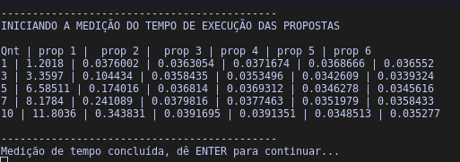
    <figcaption>Fonte: Autor - Teste com valores de arquivos por linha maiores (100)</figcaption>
    </figure>
    </p>
<p align="center">
    <figure align="center">
    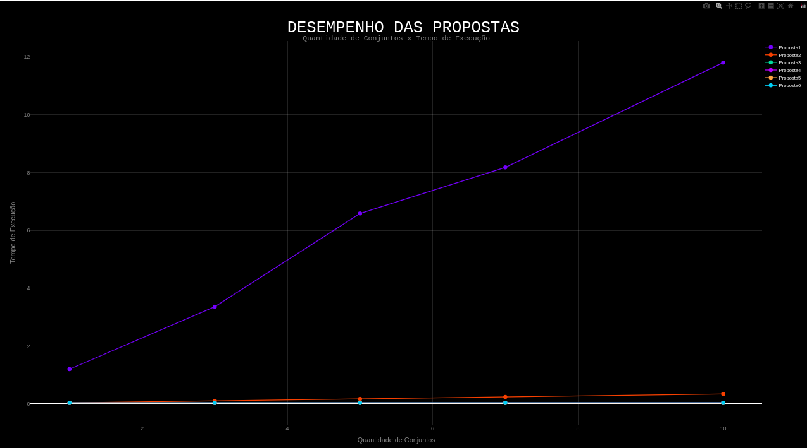
    <figcaption>Fonte: Autor - Teste com valores de arquivos por linha maiores (100)</figcaption>
    </figure>
    </p>
    
   Para uma visualizar melhortodas as propostas, ocultamos algumas.
<p align="center">
    <figure align="center">
    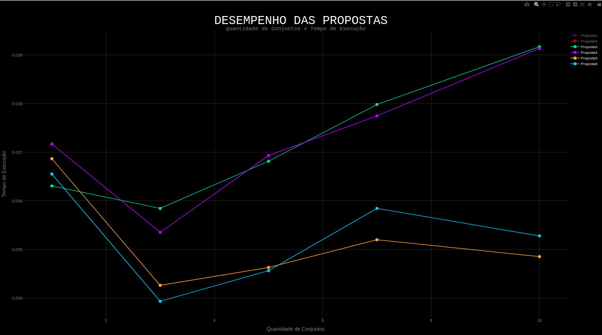
    <figcaption>Fonte: Autor - Teste com valores de arquivos por linha maiores (100)</figcaption>
    </figure>
    </p>
    
    Vemos ainda mais a piora da Proposta 1.
<p align="right"><a href="#-tópicos">⬆️ Voltar para o Sumário</a></p>

- **Terceiro teste (1000 arquivos por linha, valor igual a 10 para as outras entradas):** Inserindo valores de entrada: 

<p align="center">
    <figure align="center">
    
    <figcaption>Fonte: Autor - Teste com valores de arquivos por linha maiores (1000)</figcaption>
    </figure>
    </p>

    Depois, é executado os cálculos e plotado o gráfico: 
<p align="center">
    <figure align="center">
    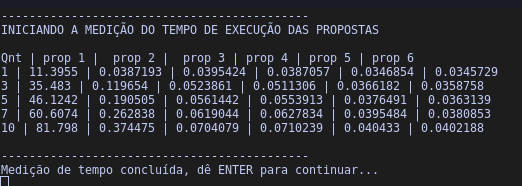
    <figcaption>Fonte: Autor - Teste com valores de arquivos por linha maiores (1000)</figcaption>
    </figure>
    </p>
<p align="center">
    <figure align="center">
    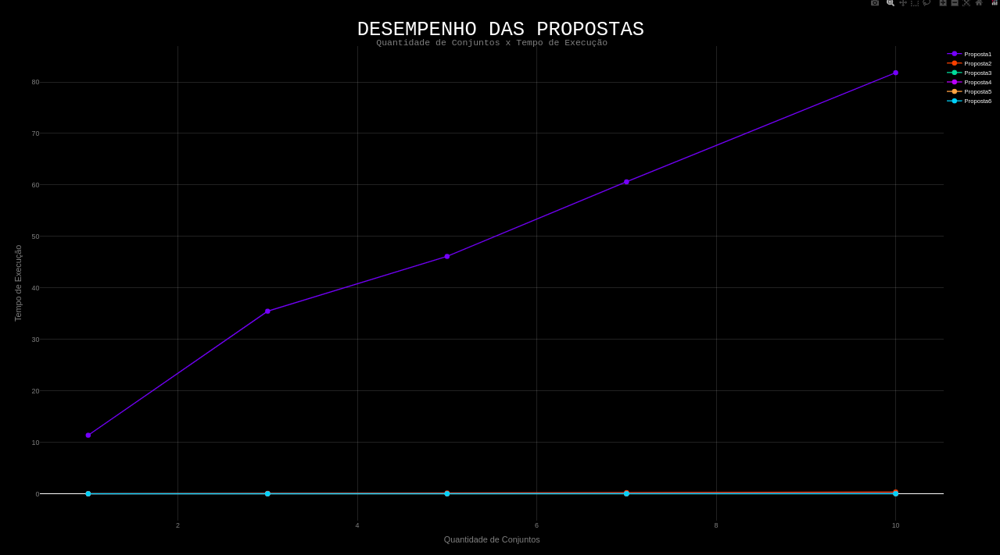
    <figcaption>Fonte: Autor - Teste com valores de arquivos por linha maiores (1000)</figcaption>
    </figure>
    </p>
    
    Neste vamos ocultar primeiro somente a Proposta 1.
<p align="center">
    <figure align="center">
    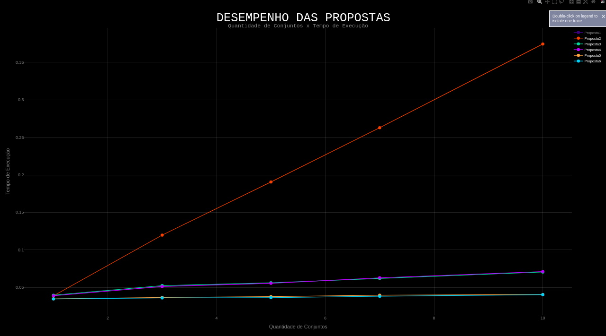
    <figcaption>Fonte: Autor - Teste com valores de arquivos por linha maiores (1000)</figcaption>
    </figure>
    </p>

    Agora ocultando a Proposta 2 também.
<p align="center">
    <figure align="center">
    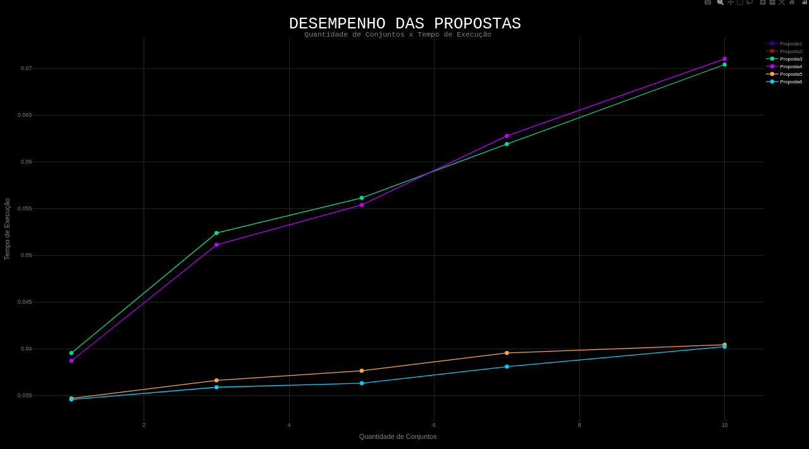
    <figcaption>Fonte: Autor - Teste com valores de arquivos por linha maiores (1000)</figcaption>
    </figure>
    </p>
    
    Com o aumento da quantidade de arquivos por linha, faz com que a Proposta 1 piore ainda mais.

Aqui, a Proposta 1 tem um péssimo desempenho pelo mesmo motivo do teste anterior, com o aumento da quantidade de arquivos faz ela fazer muitos cálculos, mesmo que muitas das vezes esses arquivos são os mesmos. E isso faz com que as Propostas que tem um cache se destacam. Vemos que as Proposta 5 e 6, novamente, se mostram muito bem em seus desempenhos. 

**OBSERVAÇÃO:** Fizemos aqui apenas testes com os valores de entrada, sem analisar exatamente os arquivos e processos que estavam sendo gerados. 
<p align="right"><a href="#-tópicos">⬆️ Voltar para o Sumário</a></p>

## 🔍 Escolha da melhor proposta 
Após os testes vemos que cada uma das propostas apresentadas oferece vantagens e desvantagens, e a escolha da melhor depende de vários fatores, como o tipo de arquivos, a estrutura dos dados e os padrões de acesso. Aqui estão algumas considerações finais sobre o desempenho de cada proposta:

**1️⃣ PROPOSTA 1: Processamento Sequencial**</u>
- **Descrição:** Cada linha de um arquivo de processo é lida e processada de forma sequencial, calculando a soma das raízes quadradas dos números nos arquivos referenciados.
- **Limitação:** Alta redundância, pois cada arquivo referenciado é processado repetidamente sem aproveitamento de cálculos anteriores, resultando em uma significativa ineficiência.

**2️⃣ PROPOSTA 2: Reaproveitamento de Cálculos por Processo**</u>
- **Descrição:** Introduz um cache para armazenar a soma das raízes quadradas de arquivos já processados dentro de um mesmo processo.
- **Melhoria:** Reduz a redundância dentro de um único processo, evitando recalcular somas de arquivos já processados.
- **Limitação:** O cache é descartado ao final de cada processo, não aproveitando os cálculos entre processos diferentes.

**3️⃣ PROPOSTA 3: Cache Global**</u>
- **Descrição:** Implementa um cache global que armazena os resultados das somas das raízes quadradas entre todos os processos.
- **Melhoria:** Aproveita os cálculos realizados entre diferentes processos, aumentando a eficiência global.
- **Limitação:** Embora o reaproveitamento de cálculos seja maximizado, a busca no cache pode ser ineficiente se não for otimizada.

**4️⃣ PROPOSTA 4: Ordenação e Reaproveitamento**</u>
- **Descrição:** Ordena as linhas de cada processo com base no número de arquivos referenciados antes de iniciar o processamento.
- **Melhoria:** Processa primeiro as linhas com mais arquivos referenciados, otimizando o reaproveitamento dos cálculos iniciais e melhorando a eficiência de cache.
- **Limitação:** A complexidade adicional da ordenação pode introduzir overhead, e a eficiência depende da distribuição dos dados. 

**5️⃣ PROPOSTA 5: Cache com Busca Binária**</u>
- **Descrição:** Utiliza um vetor de cache ordenado para armazenar resultados e implementa busca binária para recuperação eficiente dos valores já calculados.
- **Melhoria:** A busca binária permite uma recuperação muito mais rápida dos valores no cache, otimizando significativamente o tempo de execução.
- **Limitação:** A manutenção do vetor ordenado e a inserção de novos valores podem introduzir alguma complexidade adicional.

**6️⃣ PROPOSTA 6: Preprocessamento Completo com Cache**</u>
- **Descrição:** Pré-calcula a soma das raízes quadradas de todos os arquivos antes de processar os arquivos de processo, armazenando os resultados em um vetor de cache.
- **Melhoria:** Elimina completamente a necessidade de calcular somas durante o processamento dos arquivos de processo, pois todos os resultados estão pré-computados e disponíveis de forma imediata.
- **Limitação:** Requer um grande uso de memória para armazenar todos os resultados e um tempo inicial de processamento considerável para calcular todas as somas, mas este tempo é compensado pela eficiência do processamento subsequente, e em casos que não são usados todos os arquivos que foram calculados.
<p align="right"><a href="#-tópicos">⬆️ Voltar para o Sumário</a></p>

### ✅ Justificativa para Parar de Procurar Outras Maneiras
Após a implementação da Proposta 6, a análise dos tempos de execução e da eficiência revelou que:

1. **Eficiência Alta Alcançada:** O tempo de execução para processar cada linha dos arquivos de processo foi drasticamente reduzido devido ao pré-cálculo e armazenamento eficiente das somas das raízes quadradas. A busca no vetor de cache pré-calculado é extremamente rápida, praticamente eliminando o tempo de processamento repetitivo.

2. **Custo-Benefício:** Qualquer tentativa adicional de otimização apresentaria melhorias marginais a um custo operacional e de complexidade significativamente maior. A implementação de algoritmos mais sofisticados ou o uso de técnicas de paralelismo ou distribuição poderia resultar em ganhos menores em relação ao custo de implementação e manutenção.

3. **Limitação Prática:** O uso de um vetor de cache que armazena todas as somas das raízes quadradas pré-calculadas já é uma abordagem que maximiza o uso da memória disponível e do tempo de processamento inicial. As melhorias possíveis além desta abordagem seriam incrementais e não justificariam o esforço adicional necessário.

4. **Simplicidade e Mantenabilidade:** A Proposta 6, apesar de exigir um tempo de pré-processamento significativo, simplifica consideravelmente o código subsequente, tornando-o mais fácil de manter e menos propenso a erros. O design claro e eficiente facilita futuras modificações ou expansões do sistema.

Portanto, a escolha da Proposta 6 como a solução final para parar de procurar outras maneiras foi baseada em uma análise detalhada de eficiência, complexidade, custo-benefício e simplicidade de manutenção. Esta proposta atende plenamente aos requisitos do problema, fornecendo um equilíbrio ideal entre desempenho e praticidade. Além de que através de testes realizados, já conseguimos ver uma grande evolução no tempo de execução desde a primeira proposta até a última.
<p align="right"><a href="#-tópicos">⬆️ Voltar para o Sumário</a></p>

## 🎉 Conclusão 
A experiência de realizar este trabalho foi enriquecedora e desafiadora, proporcionando uma compreensão aprofundada das diferentes estratégias para otimizar a eficiência de cálculos de somas. Ao avaliar diversas propostas, foi possível observar como diferentes abordagens afetam o desempenho e a complexidade computacional. O trabalho proporcionou o entendimento das complexidades envolvidas na manipulação eficiente de dados, especialmente quando se trata de cálculos repetitivos e do gerenciamento de caches. Cada proposta trouxe desafios e aprendizados distintos, permitindo-nos experimentar com diferentes abordagens e analisar suas implicações teóricas e práticas.

Os testes realizados foram cruciais para entender o desempenho real de cada proposta. Testamos vários cenários, desde entradas pequenas e simples até configurações mais complexas com grandes volumes de dados. Esses testes demonstraram claramente como a escolha da estratégia de cache e processamento pode afetar drasticamente o tempo de execução e a eficiência geral do sistema. A análise detalhada dos tempos de execução forneceu percepções valiosas sobre os pontos fortes e fracos de cada abordagem, destacando a importância de considerar a distribuição e os padrões de acesso dos dados ao escolher uma solução.

Durante a análise, a Proposta 3 destacou-se pela eficiência devido ao uso de um cache global que minimiza redundâncias de cálculos. No entanto, a Proposta 5, com busca binária no cache, apresentou um equilíbrio interessante, mostrando-se adequada para situações com padrões de acesso muito variáveis. Já a Proposta 6 pode ser a melhor escolha em cenários onde a maioria dos arquivos é acessada, apesar do risco de calcular somas desnecessárias.

Em conclusão, o processo de implementação e análise dessas propostas nos ensinou não apenas sobre as técnicas específicas de otimização, mas também sobre a importância de uma abordagem meticulosa e baseada em dados para a resolução de problemas de desempenho. Embora a Proposta 6 tenha se destacado em termos de eficiência, ficou claro que a escolha da melhor solução depende de vários fatores, incluindo o tipo e a frequência de acesso aos arquivos. Esta experiência reforçou a importância de testar e validar rigorosamente diferentes soluções em cenários reais antes de tomar decisões de implementação.

Essa experiência reforçou a importância de uma análise cuidadosa e a realização de testes práticos ao desenvolver soluções computacionais. O processo de avaliação não só ofereceu uma compreensão mais profunda das técnicas estudadas, mas também destacou a necessidade de adaptação às especificidades de cada problema. Através deste estudo, ficou claro que não existe uma solução universalmente superior, e a escolha da melhor proposta depende das características particulares de cada aplicação.
<p align="right"><a href="#-tópicos">⬆️ Voltar para o Sumário</a></p>


## 🔧 Ambiente de Compilação
A seguir estão os detalhes do ambiente de compilação onde o programa foi executado:

| Componente      | Detalhes                          |
|-----------------|-----------------------------------|
| Sistema Operacional | Ununtu 22.04.4 LTS  - 64 bits|
| Modelo do hardware| Dell Inc. Inspiron 3501|
| Processador     | Intel® Core™ i3-1005G1 CPU @ 1.20GHz × 4|
| Memória RAM     | 8 GB, 1 de 8 GB, DDR4, 2.666 MHz|
| Armazenamento   | 256 GB, M.2 2230, PCIe NVMe de 3ª geração x4, SSD|
| IDE             | Visual Studio Code|

Observação: Os detalhes acima são baseados no ambiente de compilação utilizado durante o desenvolvimento do programa e podem variar em diferentes sistemas.
<p align="right"><a href="#-tópicos">⬆️ Voltar para o Sumário</a></p>


## ⛏ Makefile

O Makefile é um utilitário que automatiza o processo de compilação e execução de programas. Aqui estão os principais comandos do Makefile para este projeto:

| Comando      | - **Descrição **                              |
|--------------|-----------------------------------------|
| `make`       | Compila o programa.                     |
| `make run`   | Executa o programa com o arquivo de entrada fornecido. |
| `make clean` | Remove os arquivos compilados.          |
<p align="right"><a href="#-tópicos">⬆️ Voltar para o Sumário</a></p>


## 📧 Contato

Para mais informações ou sugestões, sinta-se à vontade para entrar em contato:

- ✉️ **E-mail**: [](mailto:dudateixeirasouza@gmail.com)
- 💼 **LinkedIn**: [](https://www.linkedin.com/in/maria-eduarda-teixeira-souza-2a2b3a254/)
- 📸 **Instagram**: [](https://www.instagram.com/dudat_18/)

Ficarei feliz em receber feedbacks, contribuições ou responder a quaisquer dúvidas que você possa ter sobre o programa. 
<p align="right"><a href="#-tópicos">⬆️ Voltar para o Sumário</a></p>

## 🔖 Referências
1. CEFET-MG. **Aula 1 - Análise de Algoritmos**. Disponível em: [https://ava.cefetmg.br/pluginfile.php/250215/mod_resource/content/8/Aula1.pdf](https://ava.cefetmg.br/pluginfile.php/250215/mod_resource/content/8/Aula1.pdf). Acesso em:  10 jun. 2024.

2. Arora, S., Barak, B. **Computational Complexity: A Modern Approach**. Disponível em: [https://theory.cs.princeton.edu/complexity/book.pdf](https://theory.cs.princeton.edu/complexity/book.pdf). Acesso em:  10 jun. 2024.

3. Krupansky, J. **What is Algorithmic Complexity (or Computational Complexity) and Big-O Notation?**. Disponível em: [https://jackkrupansky.medium.com/what-is-algorithmic-complexity-or-computational-complexity-and-big-o-notation-9c1e5eb6ad48](https://jackkrupansky.medium.com/what-is-algorithmic-complexity-or-computational-complexity-and-big-o-notation-9c1e5eb6ad48). Acesso em:  10 jun. 2024.

4. **Computational Complexity**. Stanford Encyclopedia of Philosophy. Disponível em: [https://plato.stanford.edu/entries/computational-complexity/](https://plato.stanford.edu/entries/computational-complexity/). Acesso em:  10 jun. 2024.

5. **Computational Complexity Theory**. Wikipedia. Disponível em: [https://en.wikipedia.org/wiki/Computational_complexity_theory](https://en.wikipedia.org/wiki/Computational_complexity_theory). Acesso em:  10 jun. 2024.

6. **Análise de Complexidade de Algoritmos**. Iugu Blog. Disponível em: [https://www.iugu.com/blog/analise-complexidade-algoritmos](https://www.iugu.com/blog/analise-complexidade-algoritmos). Acesso em:  10 jun. 2024.

7. Cormen, T. H., et al. **Algoritmos: Teoria e Prática, 3ª Edição**. Disponível em: [https://computerscience360.wordpress.com/wp-content/uploads/2018/02/algoritmos-teoria-e-prc3a1tica-3ed-thomas-cormen.pdf](https://computerscience360.wordpress.com/wp-content/uploads/2018/02/algoritmos-teoria-e-prc3a1tica-3ed-thomas-cormen.pdf). Acesso em:  10 jun. 2024.

8. Bhargava, A. Y. **Entendendo Algoritmos: Um Guia Ilustrado Para Programadores e Outros Curiosos**. Disponível em: [https://github.com/KAYOKG/BibliotecaDev/blob/main/LivrosDev/Entendendo%20Algoritmos%20-%20Um%20Guia%20Ilustrado%20Para%20Programadores%20e%20Outros%20Curiosos%20-%20Autor%20(Aditya%20Y.%20Bhargava).pdf](https://github.com/KAYOKG/BibliotecaDev/blob/main/LivrosDev/Entendendo%20Algoritmos%20-%20Um%20Guia%20Ilustrado%20Para%20Programadores%20e%20Outros%20Curiosos%20-%20Autor%20(Aditya%20Y.%20Bhargava).pdf). Acesso em:  10 jun. 2024.

9. Knuth, D. E. **The Art of Computer Programming, Vol. 1: Fundamental Algorithms, 3rd Edition**. Disponível em: [https://www.haio.ir/app/uploads/2022/01/The-Art-of-Computer-Programming-Vol.-1-Fundamental-Algorithms-3rd-Edition-by-Donald-E.-Knuth-z-lib.org_.pdf](https://www.haio.ir/app/uploads/2022/01/The-Art-of-Computer-Programming-Vol.-1-Fundamental-Algorithms-3rd-Edition-by-Donald-E.-Knuth-z-lib.org_.pdf). Acesso em:  10 jun. 2024.

10. João Arthur. **Análise Assintótica**. Disponível em: [https://joaoarthurbm.github.io/eda/posts/analise-assintotica/](https://joaoarthurbm.github.io/eda/posts/analise-assintotica/). Acesso em:  10 jun. 2024.

11. Pereira, F. **Análise de Algoritmos**. Disponível em: [https://www.ime.usp.br/~pf/analise_de_algoritmos/](https://www.ime.usp.br/~pf/analise_de_algoritmos/). Acesso em:  10 jun. 2024.

12. XVI ENID. **PROLICEN: Engenharia de Software: análise de complexidade assintótica de algoritmos**. Disponível em: [http://www.prac.ufpb.br/enex/XVENID/PROLICEN/CCAE/25.pdf](http://www.prac.ufpb.br/enex/XVENID/PROLICEN/CCAE/25.pdf). Acesso em:  10 jun. 2024.

13. Hokama. **CIC110 - Estrutura de Dados - Análise Assintótica**. Disponível em: [https://hokama.com.br/disciplinas/cic110_2019s2/02-analise-assintotica.pdf](https://hokama.com.br/disciplinas/cic110_2019s2/02-analise-assintotica.pdf). Acesso em:  10 jun. 2024.

14. Martins, A. **Análise de Complexidade de Algoritmos**. Disponível em: [http://www.deinf.ufma.br/~acmo/grad/ED_complexidade_2005.pdf](http://www.deinf.ufma.br/~acmo/grad/ED_complexidade_2005.pdf). Acesso em:  10 jun. 2024.
<p align="right"><a href="#-tópicos">⬆️ Voltar para o Sumário</a></p>
